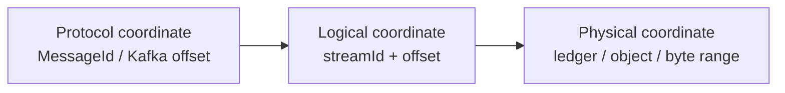

import DocBaseline from '@site/src/components/DocBaseline';

<DocBaseline commit="c820391dc1de4229362ddf833487066c32609cba" verified="2026-08-07" />

# Protocol, logical, and physical coordinates {#protocol-logical-physical-coordinates}

Nereus keeps three coordinate layers separate:



## Protocol coordinates {#protocol-coordinates}

Protocol coordinates are chosen by the client-facing system. Examples include Pulsar `MessageId` and `Position`, Kafka partition offsets, leader epochs, and cursor positions. They carry protocol semantics such as ordering, ownership, and acknowledgement rules.

## Logical coordinates {#logical-coordinates}

The core address is:

```text
streamId + offset
```

The stream identity binds a lifecycle and storage profile. The offset identifies a logical range in that stream. The committed head, trim offset, generation index, and recovery protocol all use this layer.

## Physical coordinates {#physical-coordinates}

Physical coordinates locate bytes in a provider:

- a BookKeeper ledger and entry range;
- an Object WAL root, byte range, and checksum;
- a read-optimized object generation;
- a staged materialization output before publication.

Physical coordinates can be replaced, repaired, quarantined, or retired. They must remain linked to the exact logical range and generation identity they represent.

## Why the separation matters {#why-separation-matters}

The separation gives Nereus stable semantics across:

- ledger rollover and object immutability;
- sync and async materialization profiles;
- broker unload/reload and ownership transfer;
- generation replacement and fallback reads;
- provider response loss and recovery.

If an adapter leaks a physical identifier as the logical position, a physical rewrite becomes a protocol-visible data movement event. That is precisely the coupling the storage layer is meant to remove.

## Source anchors {#source-anchors}

- [`docs/design/nereus-overall-architecture.md`](https://github.com/nereusstream/nereus/blob/c820391dc1de4229362ddf833487066c32609cba/docs/design/nereus-overall-architecture.md)
- [`docs/design/nereus-storage-object-format.md`](https://github.com/nereusstream/nereus/blob/c820391dc1de4229362ddf833487066c32609cba/docs/design/nereus-storage-object-format.md)
