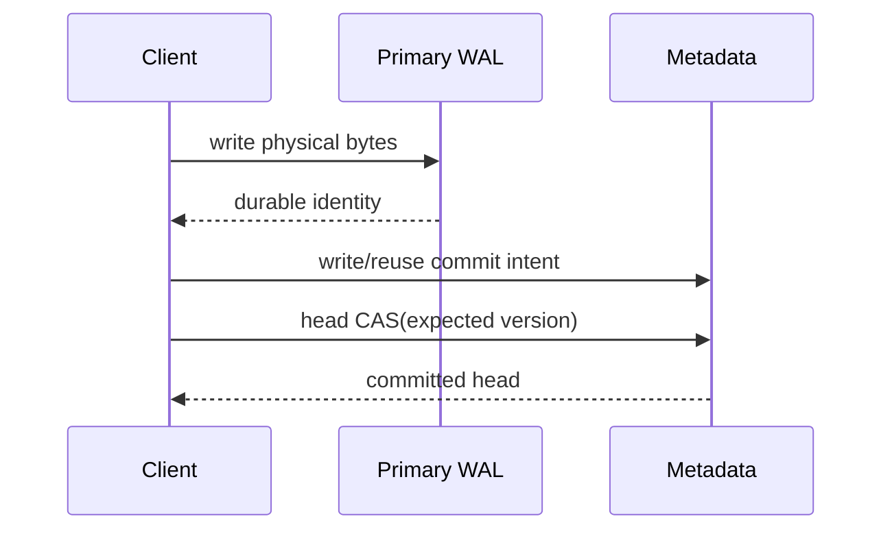

import DocBaseline from '@site/src/components/DocBaseline';

<DocBaseline commit="c820391dc1de4229362ddf833487066c32609cba" verified="2026-08-07" />

# Stream head and commit chain {#stream-head-and-commit-chain}

## Stream head {#stream-head}

The stream head is the authoritative summary of a stream's committed logical range. A head includes enough versioned state to let a writer prove that it is advancing the expected predecessor and let a reader establish a consistent snapshot.

Conceptually:

```text
head(version = v, committedEnd = n, previous = v-1)
```

The exact encoded fields are an implementation contract; the important property is that a head update is conditional on its expected version and predecessor.

## Commit chain {#commit-chain}

An append records an intent that can be found again if the caller or broker loses the response. The chain links the intent to the logical range and the physical target. Recovery can search the chain, validate exact identity, and either complete the publication or return the previously determined outcome.



## Linear visibility {#linear-visibility}

Before the head CAS succeeds, a new logical range is not part of the committed stream even if its bytes and intent are durable. After the CAS succeeds, the logical range is committed and every future reader must resolve it through the published metadata.

The rest of the profile-specific completion policy may require additional physical work before the producer receives success. That extra work does not move the logical commit point.

## Response loss {#response-loss}

If the head CAS request was sent but its response was lost, retrying the physical write blindly is unsafe. The caller must use the stable append identity and expected predecessor to determine whether the original operation committed, is still recoverable, or is definitively not committed.

## Source anchors {#source-anchors}

- [`docs/design/nereus-commit-protocol.md`](https://github.com/nereusstream/nereus/blob/c820391dc1de4229362ddf833487066c32609cba/docs/design/nereus-commit-protocol.md)
- [`docs/phase-1-core-stream-storage/09-legacy-oxia-multi-key-commit-design.md`](https://github.com/nereusstream/nereus/blob/c820391dc1de4229362ddf833487066c32609cba/docs/phase-1-core-stream-storage/09-legacy-oxia-multi-key-commit-design.md)
