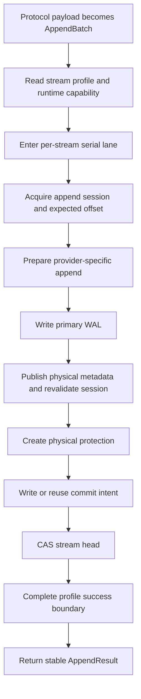

import DocBaseline from '@site/src/components/DocBaseline';

<DocBaseline commit="c820391dc1de4229362ddf833487066c32609cba" verified="2026-08-07" />

# Append flow {#append-flow}

All storage profiles share one logical append protocol. The provider-specific WAL and the producer completion boundary change by profile, but the commit point does not.

## The pipeline {#pipeline}

## 1. Form the protocol-neutral batch {#form-batch}

Pulsar passes a complete Entry to the ManagedLedger compatibility boundary. The core does not decode Pulsar command metadata or split batch messages into separate Nereus offsets.

Native Kafka first performs Kafka validation, offset assignment, producer/transaction checks, and RecordBatch validation. Each RecordBatch enters the storage core as a ranged entry; Kafka-specific types stay in the adapter or Kafka fork.

The caller may provide `expectedStartOffset`. If the committed end has already changed, the core rejects before WAL I/O rather than allowing an old owner to append at a guessed position.

## 2. Check the durable profile {#check-profile}

The stream profile determines the primary WAL, required index state, object work, and producer completion policy. The runtime must have matching writers, readers, and completion coordinators installed. The safe default is fail closed: an unsupported combination returns a capability error before physical I/O.

An async profile may also reject new work when its materialization lag admission is above the configured bound. That protects the primary WAL from unbounded backlog; it does not roll back already committed data.

## 3. Serialize locally and fence globally {#serialize-and-fence}

The in-process per-stream lane serializes append A, B, and C. If A is uncertain, B and C wait instead of guessing whether the next offset is the old or new end.

The lane is not a cross-Broker lock. The append session and the stream-head CAS provide the durable fencing boundary. A session includes an epoch, fencing token, writer identity, and expiry. A new owner obtains a higher epoch, making the old owner stale.

## 4. Prepare and write the primary WAL {#write-primary-wal}

The provider writer freezes exact bytes, record/entry counts, logical bytes, physical attempt identity, and the expected target. It must not silently change the payload format or range.

- Object WAL performs an immutable PUT and validates key, declared length, checksum, and manifest.
- BookKeeper WAL writes a contiguous exact entry range and waits for its configured acknowledgement quorum.

The result is a durable physical target, not yet a committed logical range.

## 5. Protect the physical target {#protect-target}

Before the head can reference the target, durable protection tells GC that a pending append uses it. Object targets use a physical-root protection; BookKeeper targets use a fixed range protection slot. The creator rereads the root or protection identity to close a mark/create race.

## 6. Write or reuse the commit intent {#commit-intent}

The commit ID is deterministic for the same logical append identity and physical attempt. A retry reuses the same intent and target. If a supposedly immutable key exists with different content, the system reports a metadata invariant violation instead of overwriting it.

The intent freezes the expected start, counts, payload metadata, writer/session identity, and exact `ReadTarget`.

## 7. Publish the logical range with head CAS {#head-cas}

The head update checks the expected metadata version, expected committed end, session epoch/token, and external authority. On success it advances the committed end, cumulative logical size, commit version, and last commit ID.

This successful version-CAS is the append linearization point. A later index or Object completion failure cannot roll back the committed offset.

## 8. Complete the profile boundary {#completion-boundary}

After head publication, the profile may require only a stable head, a confirmed generation-0 index, or a verified higher Object generation. This controls when the producer receives success; it does not change when the logical range became committed.

## 9. Return `AppendResult` {#append-result}

The result includes `streamId`, stable offset range, committed end, cumulative logical size, commit version, generation-0 `ReadTarget`, payload format, and record/entry counts. Generation 0 identifies the original append target even if a later read selects generation 1 or 2.

### Example {#example}

If the head is `committedEndOffset = 100`, and two Kafka RecordBatches contain 3 and 2 records, the append commits `[100,105)`, advances the head to `105`, and increments the commit version once. The physical BookKeeper entry IDs remain an internal target; Kafka sees offsets 100 through 104.

## Source anchors {#source-anchors}

- [`AppendCoordinator.java`](https://github.com/nereusstream/nereus/blob/c820391dc1de4229362ddf833487066c32609cba/nereus-core/src/main/java/com/nereusstream/core/append/AppendCoordinator.java)
- [`AppendSessionManager.java`](https://github.com/nereusstream/nereus/blob/c820391dc1de4229362ddf833487066c32609cba/nereus-core/src/main/java/com/nereusstream/core/append/AppendSessionManager.java)
- [`docs/design/nereus-commit-protocol.md`](https://github.com/nereusstream/nereus/blob/c820391dc1de4229362ddf833487066c32609cba/docs/design/nereus-commit-protocol.md)
