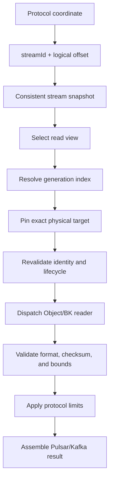

import DocBaseline from '@site/src/components/DocBaseline';

<DocBaseline commit="c820391dc1de4229362ddf833487066c32609cba" verified="2026-08-07" />

# Read flow {#read-flow}

The read path resolves a logical snapshot before choosing a physical reader. It never treats a provider's latest bytes as a substitute for committed metadata.

## 1. Convert the protocol coordinate {#coordinate-conversion}

Pulsar validates the projection incarnation and maps `Position(virtualLedgerId, entryId)` or `MessageId` to a `streamId` and logical start offset. Kafka resolves `topicId + partition` through the partition binding and uses `fetchOffset` as the logical offset.

The virtual ledger ID is a stable compatibility coordinate. It is not a BookKeeper ledger ID and does not change when physical materialization or ledger rollover changes the target.

## 2. Read a consistent snapshot {#snapshot}

The resolver reads stream metadata, committed end, trim offset, and metadata version as one resolution snapshot. It returns `OFFSET_TRIMMED` when the requested offset is below the logical trim boundary and normal EOF when it is at or beyond the committed end.

EOF is not a permanent negative cache: a later append may advance the head.

## 3. Select view and candidate {#candidate}

The request chooses a read view before candidate scanning. Normal Pulsar and Kafka reads use `COMMITTED`; explicit compacted reads use `TOPIC_COMPACTED`. The resolver scans only candidates in that view whose range covers the offset, lifecycle is visible, version does not lead the current head, and reader type is installed.

Within those constraints, it prefers the highest healthy generation. “Highest wins” is not a global numeric rule.

## 4. Pin and revalidate {#pin}

Object targets receive a durable reader pin; BookKeeper targets receive a fixed reader slot and a non-recovery open. The resolver then rechecks exact index key/version/SHA, physical-root lifecycle, range, publication ID, and target identity. If revalidation fails, it releases the protection and tries another valid candidate.

## 5. Dispatch and validate bytes {#physical-read}

`ReadTargetDispatcher` chooses the registered reader by target type. The reader checks physical identity, bounds, entry/record counts, checksums, format/version, source identity, and schema/payload references. A valid checksum cannot make an invalid structure acceptable; unknown versions, trailing bytes, and out-of-bounds indexes fail closed.

## 6. Apply protocol boundaries {#protocol-result}

The storage reader respects `maxRecords`, `maxBytes`, and the boundary/first-entry policy. It returns complete physical entries to the adapter, which applies protocol-specific metadata, transaction visibility, HW/LSO, batch indexes, and client response assembly.

## Source anchors {#source-anchors}

- [`ReadResolver.java`](https://github.com/nereusstream/nereus/blob/c820391dc1de4229362ddf833487066c32609cba/nereus-core/src/main/java/com/nereusstream/core/read/ReadResolver.java)
- [`GenerationReadResolver.java`](https://github.com/nereusstream/nereus/blob/c820391dc1de4229362ddf833487066c32609cba/nereus-core/src/main/java/com/nereusstream/core/read/GenerationReadResolver.java)
- [`ReadCoordinator.java`](https://github.com/nereusstream/nereus/blob/c820391dc1de4229362ddf833487066c32609cba/nereus-core/src/main/java/com/nereusstream/core/read/ReadCoordinator.java)
