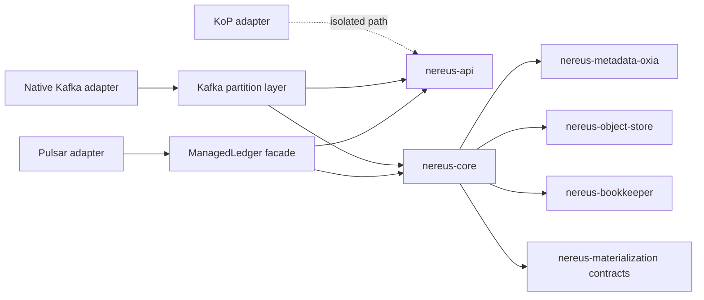

import DocBaseline from '@site/src/components/DocBaseline';

<DocBaseline commit="c820391dc1de4229362ddf833487066c32609cba" verified="2026-08-07" />

# Module boundaries {#module-boundaries}

The repository separates protocol-neutral storage contracts from provider implementations and
protocol adapters. The important rule is directional: protocol types map down to neutral values;
they must not leak back into `nereus-core` or `nereus-api`.

## Responsibilities {#responsibilities}

| Module | Owns | Boundary rule |
| --- | --- | --- |
| `nereus-api` | `StreamStorage`, IDs, append/read values, profiles, targets, trim/seal/delete options | Must not depend on Pulsar, Kafka, BookKeeper client, or an Object SDK |
| `nereus-core` | Append lane/session, primary-WAL registry, stable commit, generation-0 materialization, recovery, read, trim, lifecycle, provider-neutral physical-reference SPI | May know neutral BookKeeper target shapes, not `RecordBatch` or ManagedLedger types |
| `nereus-metadata-oxia` | Oxia keyspace, records/codecs/stores for head, commit, index, session, task, checkpoint, root, cursor, projection, binding, scan/watch/CAS | Hydrates durable records into canonical in-memory models |
| `nereus-object-store` | Object provider API, S3-compatible provider, Object WAL, range read, HEAD, guarded/replayable upload, checksums, conditional delete | Exposes provider-neutral results upward |
| `nereus-bookkeeper` | Ledger namespace, allocator/recovery, writer/reservation, primary WAL, reader leases, materialization source, whole-ledger retention, activation | Uses BookKeeper public API without ManagedLedger types |
| `nereus-materialization` | Policy/planner/task, worker/staging/publication, generation allocator/index, NCP/NTC formats, recovery checkpoints, source retirement, physical roots/protection/pins/GC | Depends on core contracts; core does not depend on one worker implementation |
| `nereus-managed-ledger` | Pulsar-compatible facade, projection/virtual Position, ManagedLedger/ManagedCursor mapping, owner/hydration/snapshot/retention handoff | Converts Pulsar values to neutral API values |
| `nereus-pulsar-adapter` | Broker config, storage-class binding, runtime/readiness, policies, admin route, lifecycle assembly | Owns Pulsar runtime wiring, not L0 commit truth |
| `nereus-kafka-adapter` | Native Kafka activation/binding, RecordBatch Produce/Fetch, leader authority, checkpoint/recovery, DeleteRecords, NTC2, admission | Kafka server/common types stay here or in the Kafka fork |
| `nereus-kop-adapter` | KoP-facing isolation boundary | Must not depend on Native Kafka adapter or read its projection formats |
| `nereus-bom` | Module and external dependency versions | Keeps adapter composition aligned |

## Dependency direction {#dependency-direction}

The diagram describes allowed conceptual direction, not a license for cyclic implementation
dependencies. Adapters can compose provider runtimes, but a provider response must be reduced to a
protocol-neutral target, outcome, or typed error before it crosses into the shared core.

## Review rules {#review-rules}

When a change crosses a module boundary, verify:

1. protocol-specific values are translated at the adapter/facade edge;
2. the shared core still owns the logical head and commit linearization;
3. provider-specific retries preserve exact identity and outcome semantics;
4. metadata codecs hydrate legacy and current records into one canonical model;
5. tests do not pass because a protocol adapter accidentally bypassed the core contract.

## Source anchors {#source-anchors}

- [`settings.gradle.kts`](https://github.com/nereusstream/nereus/blob/c820391dc1de4229362ddf833487066c32609cba/settings.gradle.kts)
- [`nereus-api/build.gradle.kts`](https://github.com/nereusstream/nereus/blob/c820391dc1de4229362ddf833487066c32609cba/nereus-api/build.gradle.kts)
- [`nereus-core/build.gradle.kts`](https://github.com/nereusstream/nereus/blob/c820391dc1de4229362ddf833487066c32609cba/nereus-core/build.gradle.kts)
- [`Overall architecture`](https://github.com/nereusstream/nereus/blob/c820391dc1de4229362ddf833487066c32609cba/docs/design/nereus-overall-architecture.md)
