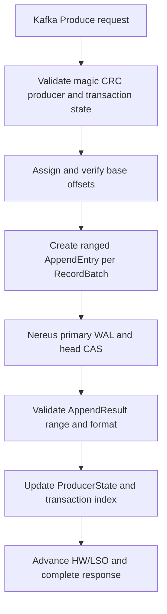

import DocBaseline from '@site/src/components/DocBaseline';

<DocBaseline commit="c820391dc1de4229362ddf833487066c32609cba" verified="2026-08-07" />

# Kafka produce and fetch {#kafka-produce-and-fetch}

Native Kafka keeps Kafka-specific validation and response assembly outside the protocol-neutral
append/read core. A `RecordBatch` remains a complete byte-owned unit, while `recordCount` expresses
the logical offset range it covers.

## Produce pipeline {#produce}



For each batch:

- payload is the complete, owned `RecordBatch` bytes;
- `recordCount` is the number of records in the batch;
- the first batch base offset equals the expected Nereus start;
- the append range is the sum of all batch record counts;
- the returned format must be `KAFKA_RECORD_BATCH` and its start/end/count must match Kafka’s request.

Any mismatch is an invariant violation. The adapter must not guess a new offset or silently split a
batch after Nereus has committed it.

## Why the entry is ranged {#ranged-entry}

Splitting a RecordBatch into one physical payload per record would break batch CRC, compression,
producer sequence, transaction markers, and exact-byte compatibility. Nereus therefore stores the
complete batch and maps it to a half-open logical range. A batch with base offset 100 and four
records covers `[100,104)` while occupying one Nereus entry.

## Fetch pipeline {#fetch}

```text
KafkaApis.handleFetchRequest
  -> ReplicaManager.fetchMessages
  -> Partition.readRecords
  -> NereusLogRecords
  -> semantic read(COMMITTED or TOPIC_COMPACTED, CONTAINING_ENTRY)
  -> KafkaFetchAssembler
  -> logStart/HW/LSO/aborted-transaction and fetch-budget filters
  -> FetchResponse
```

If a request starts at offset 102 inside `[100,104)`, the storage layer reads the complete valid
RecordBatch. The Kafka assembler then exposes records starting at 102; physical completeness and
protocol response boundaries are intentionally separate.

## Source anchors {#source-anchors}

- [`DefaultKafkaPartitionStorage.java`](https://github.com/nereusstream/nereus/blob/c820391dc1de4229362ddf833487066c32609cba/nereus-kafka-adapter/src/main/java/com/nereusstream/kafka/partition/DefaultKafkaPartitionStorage.java)
- [`Kafka ranged-entry contract`](https://github.com/nereusstream/nereus/blob/c820391dc1de4229362ddf833487066c32609cba/docs/phase-9-kafka-native-storage/02-ranged-entry-api-and-object-format.md)
- [`Kafka fork log and Broker integration`](https://github.com/nereusstream/nereus/blob/c820391dc1de4229362ddf833487066c32609cba/docs/phase-9-kafka-native-storage/03-kafka-fork-log-and-broker-integration.md)
