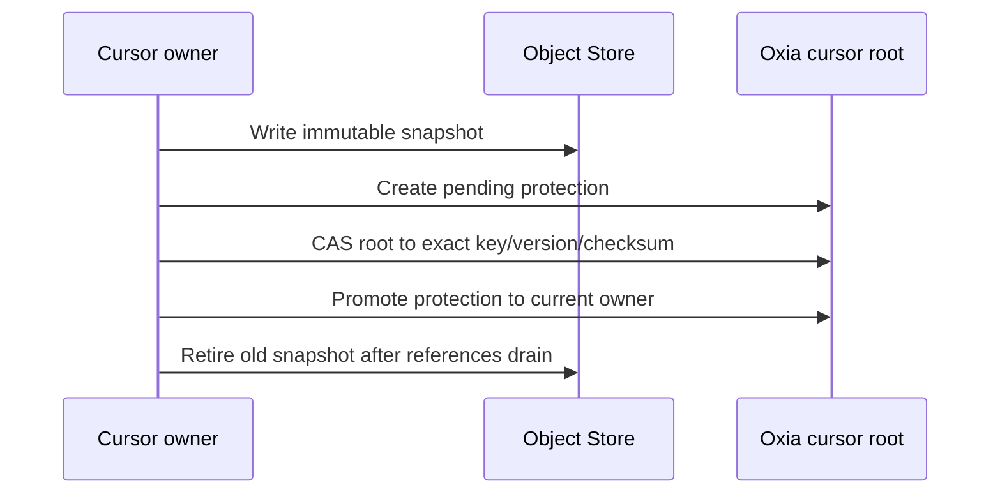

import DocBaseline from '@site/src/components/DocBaseline';

<DocBaseline commit="c820391dc1de4229362ddf833487066c32609cba" verified="2026-08-07" />

# Pulsar cursor and subscription {#pulsar-cursor-and-subscription}

A Pulsar durable subscription is more than one read Position. Nereus stores the complete ack state
behind one correctness root so cumulative ack, individual holes, partial batch ack, properties, and
reset/recreate operations share one conditional update boundary.

## Cursor root and offset projection {#cursor-root}

`CursorStateRecord` is the authoritative root for one cursor generation. Internally,
`markDeleteOffset` is the first not-yet-cumulatively-acknowledged Entry offset. The Pulsar API
projects it back by one Entry:

```text
markDeleteOffset = 100
Pulsar mark-deleted Position = entry 99
```

Whole-entry individual acknowledgements are normalized to sorted, non-overlapping half-open ranges,
for example `[105,110)` and `[120,121)`. Adjacent ranges are merged. A partial batch ack keeps the
Entry offset and a remaining-bit map; `batchIndex` remains nested state and is never promoted to a
Nereus stream offset.

## Durable state versus local dispatch position {#local-read-position}

The dispatcher’s next local read position is an in-memory optimization, not ack truth. Persisting it
on every read would create metadata pressure and could skip an unacknowledged Entry after a crash.
After restart, the Broker hydrates the durable ack state and may redeliver messages; it must not lose
the unacknowledged range.

## Cursor snapshots {#cursor-snapshots}

Large ack-hole, partial-batch, or property state is stored in an immutable snapshot object. The
cursor root references it only after a protected, versioned CAS:



Snapshot bytes alone are not visible ack state. A reader or recovery path follows the exact root
reference, version, and checksum.

## Cursor generations and reset epochs {#cursor-generations}

Two monotonic values fence different operations:

| Value | Scope | Purpose |
| --- | --- | --- |
| Cursor generation | Delete/recreate lifecycle | Stops an old handle from writing a new same-named cursor |
| `ackStateEpoch` | One cursor generation | Stops a delayed ack from rebasing across reset/clear-backlog replacement |

Normal monotonic ack may rebase only when the epoch is unchanged. A reset or clear-backlog operation
publishes a new state epoch and prevents late old acknowledgements from marking reset data as acked.

## Writable open and retention floor {#writable-open}

When a Broker opens a writable ManagedLedger, it must claim the stream-level cursor-retention root,
stabilize all active cursor roots, recover pending protection/trim states, and then revalidate Pulsar
Topic ownership. The owner session fences delayed CAS operations from a crashed Broker; the Pulsar
ownership watch alone is not a durable fence.

Retention uses a conservative cursor protection floor: the lowest offset any active cursor may still
need. New cursors, recreated cursors, and backward resets first enter `PROTECTION_PENDING`; the floor
may move backward and must be finalized before trim can advance. This closes the race where GC is
about to remove an old range while another operation creates an earliest subscription.

## Subscription admission {#admission}

The facade can expose ordinary ManagedLedger operations, durable cursors, and the supported
subscription paths, but every advanced operation must pass an explicit capability and lifecycle
check. Unsupported semantics fail before a partial stock mutation or physical storage operation.

## Source anchors {#source-anchors}

- [`NereusManagedCursor.java`](https://github.com/nereusstream/nereus/blob/c820391dc1de4229362ddf833487066c32609cba/nereus-managed-ledger/src/main/java/com/nereusstream/managedledger/NereusManagedCursor.java)
- [`CursorStateRecord.java`](https://github.com/nereusstream/nereus/blob/c820391dc1de4229362ddf833487066c32609cba/nereus-metadata-oxia/src/main/java/com/nereusstream/metadata/oxia/records/CursorStateRecord.java)
- [`Phase 3 cursor and subscription contract`](https://github.com/nereusstream/nereus/blob/c820391dc1de4229362ddf833487066c32609cba/docs/phase-3-cursor-subscription/README.md)
- [`NereusManagedLedgerRetentionService.java`](https://github.com/nereusstream/nereus/blob/c820391dc1de4229362ddf833487066c32609cba/nereus-managed-ledger/src/main/java/com/nereusstream/managedledger/retention/NereusManagedLedgerRetentionService.java)
