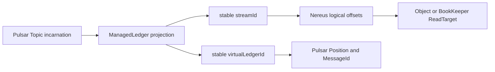

import DocBaseline from '@site/src/components/DocBaseline';

<DocBaseline commit="c820391dc1de4229362ddf833487066c32609cba" verified="2026-08-07" />

# Pulsar integration {#pulsar-integration}

Nereus integrates with Pulsar through a ManagedLedger-compatible facade. Pulsar keeps Topic,
ownership, Position, MessageId, Subscription, and protocol behavior; the facade maps persistence
operations to `StreamStorage` and keeps physical BookKeeper/Object targets out of the public
coordinate.

## Projection model {#projection-model}



One Pulsar Topic partition creation lifecycle maps to one projection incarnation and one Nereus
stream. A complete Pulsar Entry—ordinary or compressed/batched—maps to one Nereus offset with
`recordCount = 1`. `MessageId.batchIndex` identifies a sub-message inside that Entry and does not
consume another Nereus offset.

## Durable storage-class binding {#storage-class-binding}

Before the first writable open, the Pulsar fork creates or claims a durable binding that fixes the
Topic lifecycle to stock BookKeeper or the Nereus ManagedLedger facade. The binding includes storage
class, generation/incarnation, and lifecycle facts; it does not store message offsets or cursor ack
truth.

The binding prevents two Brokers from choosing different storage implementations during the first
open. A policy change cannot silently create a second empty store for a non-empty Topic. Deleting a
Topic leaves a tombstone; recreating the same name advances the incarnation and obtains a new stream
identity rather than reusing old MessageIds.

## Append and read mapping {#append-and-read}

The write path is:

```text
PersistentTopic publish
  -> ManagedLedger.addEntry
  -> NereusManagedLedger
  -> AppendEntry(full Pulsar Entry bytes, recordCount=1)
  -> StreamStorage.append
  -> logical range [offset, offset + 1)
  -> Position(virtualLedgerId, offset)
  -> addComplete callback
```

The Position is derived from the projection and logical offset, never from a physical ledger ID or
Object slice. On read, the facade validates the `virtualLedgerId`, requests a `COMMITTED`
`EXACT_START` read at the Position's entry offset, returns the complete Entry bytes, and lets the
Pulsar Broker decode metadata, compression, and batch indexes.

Higher-generation formats may reorganize bytes, but they must retain enough complete Entry payload
to reconstruct the original Pulsar Entry. A normalized column layout is an index or query aid, not
the authority for rebuilding a Pulsar message.

## Ownership and capability boundaries {#boundaries}

Pulsar Topic ownership decides which Broker may initiate a writable open. The durable Nereus owner
session and cursor roots fence crash-delayed metadata writes. Before publishing an open facade, the
runtime restores pending retention/cursor states, validates the current Topic owner, and checks that
the installed storage profile and capability set are supported.

Unsupported advanced semantics, online storage-class migration, and incompatible system-topic modes
must be rejected by explicit admission before a stock mutation or physical I/O. The facade does not
guess support after an operation has partially executed.

## Source anchors {#source-anchors}

- [`NereusManagedLedger.java`](https://github.com/nereusstream/nereus/blob/c820391dc1de4229362ddf833487066c32609cba/nereus-managed-ledger/src/main/java/com/nereusstream/managedledger/NereusManagedLedger.java)
- [`VirtualLedgerProjection.java`](https://github.com/nereusstream/nereus/blob/c820391dc1de4229362ddf833487066c32609cba/nereus-managed-ledger/src/main/java/com/nereusstream/managedledger/projection/VirtualLedgerProjection.java)
- [`PositionProjection.java`](https://github.com/nereusstream/nereus/blob/c820391dc1de4229362ddf833487066c32609cba/nereus-managed-ledger/src/main/java/com/nereusstream/managedledger/projection/PositionProjection.java)
- [`Phase 2 ManagedLedger facade contract`](https://github.com/nereusstream/nereus/blob/c820391dc1de4229362ddf833487066c32609cba/docs/phase-2-managed-ledger-facade/README.md)
