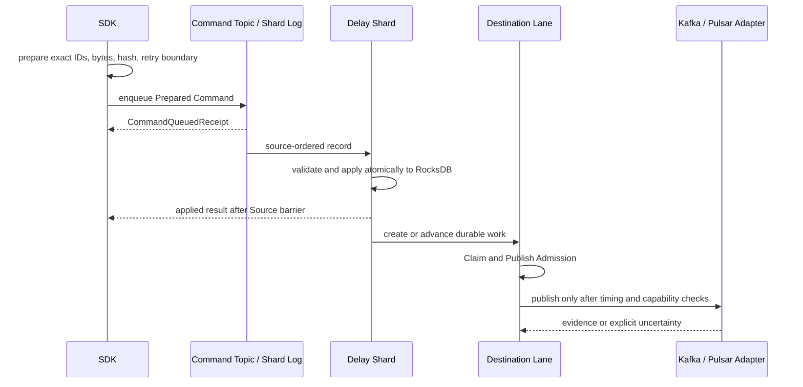

import DocBaseline from '@site/src/components/DocBaseline';

<DocBaseline commit="9281890f42772cc01b6b2b607fd93e31de64879b" verified="2026-08-07" source="nereusstream/nereus-delay" />

# Schedule flow {#schedule-flow}

The normal managed path has separate preparation, enqueue, application, scheduling, and publication boundaries:

## 1. Prepare before I/O {#prepare-before-io}

The SDK fixes route incarnation, partition, command identity, `delayMessageId`, canonical body, command hash, and retry deadline locally. A caller may persist the prepared command before submitting it.

## 2. Enqueue is only queued {#enqueue-is-only-queued}

The Command Topic is a durable ingress boundary. A `CommandQueuedReceipt` proves Broker persistence for that physical enqueue, not authoritative application. Definitely-not-queued requires a closed non-persistence proof; timeout, cancellation, connection loss, and process exit remain uncertain.

## 3. Apply in Source Position order {#apply-in-source-position-order}

The Ingress Adapter supplies a physical Source Position. The Shard Runtime applies Commands and signed System Mutations in that order, using one atomic RocksDB batch before advancing the replay cursor. A successful Schedule creates a Delayed Message; a deterministic validation or policy failure records a stable rejection instead.

## 4. Claim and Publish Admission {#claim-and-publish-admission}

The Scheduler may select eligible Lane work, but only the ordered state machine can create the Claim and the Publish Admission. Admission is the point of no return for cancellation and rescheduling. The Producer call occurs only after the durable Admission batch, Owner/Store fence, time boundary, capability, and Lane readiness checks succeed.

## 5. Query and read barriers {#query-and-read-barriers}

An applied receipt or query must be tied to the correct Command identity, source metadata, and Source Position. The Query Barrier requires an active shard to have durably applied through the requested position; it does not require every Destination Lane to be ready.

## Recovery rule {#recovery-rule}

On response loss, retry behavior follows the typed outcome and capability evidence. The service never converts a missing callback into a definitive non-publication claim merely because the local future timed out.
