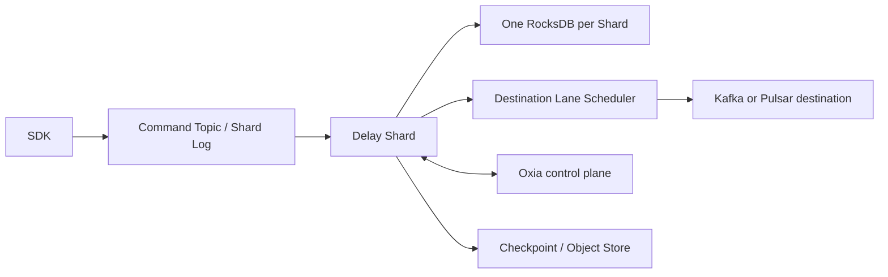

import DocBaseline from '@site/src/components/DocBaseline';

<DocBaseline commit="9281890f42772cc01b6b2b607fd93e31de64879b" verified="2026-08-07" source="nereusstream/nereus-delay" />

# Nereus Delay documentation

Nereus Delay is a Java 21 library and service core for durable delayed-message scheduling across Kafka and Pulsar destinations. The V1 model separates durable command ordering, Delay Shard application, destination scheduling, producer evidence, and recovery.

The V1 semantic and protocol baseline is frozen as `V1-FROZEN-2026-08-01`. This site is an explanation layer; the design, Protocol Registry, accepted ADRs, implementation status, audit, and terminology sources remain authoritative in the product repository.

## Start here {#start-here}

- [Why Nereus Delay?](./overview/why-nereus-delay.md) — goals, boundaries, and why scheduling needs durable state.
- [Architecture](./overview/architecture.md) — the end-to-end components and their authority boundaries.
- [Delivery time and action time](./concepts/delivery-time-and-action-time.md) — the not-before timing model.
- [Commands, messages, and receipts](./concepts/commands-messages-and-receipts.md) — queued, applied, published, and uncertain results.
- [Schedule flow](./data-paths/schedule-flow.md) — how a prepared operation moves through the Shard Log and state machine.
- [Current project status](./development/project-status.md) — implementation evidence and remaining release blockers.
