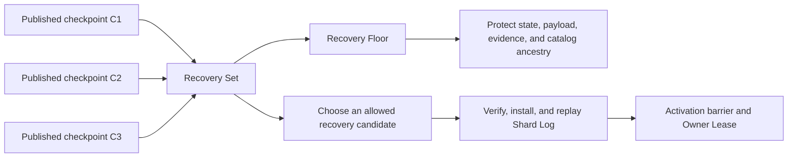

import DocBaseline from '@site/src/components/DocBaseline';

<DocBaseline commit="9281890f42772cc01b6b2b607fd93e31de64879b" verified="2026-08-07" source="nereusstream/nereus-delay" />

# Checkpoints and recovery {#checkpoints-and-recovery}

Recovery is a source- and checkpoint-bounded procedure, not a local database restart followed by blind scheduling.

## Recovery Checkpoint {#recovery-checkpoint}

A Recovery Checkpoint is a complete physical snapshot of one Delay Shard database whose manifest has been verified and authoritatively published. Uploaded files or manifests that are not published in the shard checkpoint catalog are not recovery state.

## Recovery Set and Recovery Floor {#recovery-set-and-floor}

The Recovery Set is the bounded ordered set of published checkpoints that a shard may choose. The Recovery Floor is the oldest checkpoint still permitted by that set. State, payload objects, evidence, and control material required by any checkpoint at or above the floor remain protected from garbage collection.

The latest checkpoint is not automatically the floor. GC may retire a resource only after the floor and all relevant source/replay/evidence obligations prove that no permitted recovery image still requires it.

## Restore sequence {#restore-sequence}

1. Select an allowed local or catalog checkpoint from the Recovery Set.
2. Pin the exact recovery candidate and observed floor through the Oxia session authority.
3. Verify checkpoint identity, manifest, lineage, object identity, and integrity before installation.
4. Rebuild the local RocksDB instance and replay the Shard Log through the typed Source Assignment and Activation Barrier.
5. Acquire the Owner Lease and open command application only after the authority transition and local fence agree.
6. Rebuild Lane projections and verify each Lane's capability and evidence readiness independently.

## No warm standby claim {#no-warm-standby-claim}

V1 uses checkpoint plus Shard Log replay recovery and limits the design to one active recovery cell. The product page and status page therefore do not claim transparent multi-cell failover or release-ready disaster recovery.

## Source anchors {#source-anchors}

- `docs/Nereus Delay V1 设计.md`, section 16.
- `docs/adr/0011-tie-recovery-and-garbage-collection-to-a-checkpoint-floor.md`.
- `docs/adr/0027-use-checkpoint-replay-recovery-without-warm-standby.md`.
- `docs/adr/0040-use-ancestry-bound-recovery-lineages-and-pins.md`.
