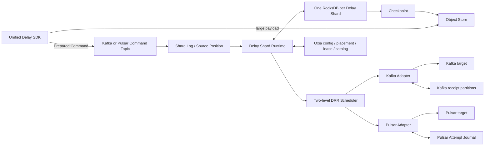

import DocBaseline from '@site/src/components/DocBaseline';

<DocBaseline product="Nereus Delay" repository="nereusstream/nereus-delay" authority="reader-facing-summary" commit="9281890f42772cc01b6b2b607fd93e31de64879b" verified="2026-08-07" />

# Architecture {#architecture}

The V1 architecture is organized around a durable source order and an explicit authority split:



## One Delay Shard {#one-delay-shard}

V1 fixes the following identity:

```text
one Ingress Route partition
= one Shard Log source order
= one Delay Shard application and ownership unit
= one RocksDB database
= one checkpoint / restore / local migration unit
```

The Shard Runtime is the single-writer boundary for the local state machine. It atomically applies Commands and authenticated System Mutations to RocksDB before advancing the source cursor.

## Authority boundaries {#authority-boundaries}

| Component | Owns | Does not own |
| --- | --- | --- |
| Command Topic / Shard Log | Durable source order and replay input | Materialized message state |
| Delay Shard / RocksDB | Applied commands, message state, indexes, receipts, and runtime projections | Cross-shard transactions |
| Scheduler | Eligibility, fairness, Claim, and Publish Admission | Sending around the state machine |
| Destination Adapter | Target identity, capability evidence, and publish outcome classification | Rewriting payload or binding |
| Oxia | Configuration, placement, Owner Lease, and checkpoint catalog CAS | Large payload bytes |
| Object Store | Immutable payloads and checkpoint objects | Which checkpoint is authoritative |

## Readiness is layered {#readiness-is-layered}

Ownership and command readiness are not the same as destination Lane readiness. A restored shard must verify its source assignment, replay through its activation barrier, and hold a valid Owner Lease before applying Commands. Each Destination Lane separately verifies its capability and evidence boundary before the scheduler may admit work.

## Source anchors {#source-anchors}

- `docs/Nereus Delay V1 设计.md`, sections 1, 4, 9, 10, 12, and 16.
- `docs/adr/0004-use-one-rocksdb-database-per-delay-shard.md`.
- `docs/adr/0017-require-source-assignment-and-an-oxia-owner-lease.md`.
