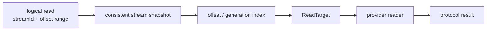

import DocBaseline from '@site/src/components/DocBaseline';

<DocBaseline product="Nereus" repository="nereusstream/nereus" authority="reader-facing-summary" commit="c820391dc1de4229362ddf833487066c32609cba" verified="2026-08-07" />

# Read targets and offset indexes {#read-target-and-offset-index}

## ReadTarget {#read-target}

A `ReadTarget` is the provider-neutral description of how to read a logical range. It carries the stream range, physical identity, generation/view information, and the boundary mode needed by the reader.

The core can therefore ask a dispatcher for a reader without knowing whether the bytes live in BookKeeper, an Object WAL, or a higher read-optimized generation.

## Offset index {#offset-index}

The offset index is a derived directory from logical ranges to physical targets. It accelerates reads but is not the authority for whether a range is committed. If it is missing or stale, the implementation can rebuild or repair it from the committed stream state and exact physical metadata.

## Boundary modes {#boundary-modes}

- `EXACT_START` requires a physical entry that starts at the requested logical boundary.
- `CONTAINING_ENTRY` permits a ranged physical entry to contain the requested offset, then decodes the requested subrange.

The second mode is important for Kafka `RecordBatch` ranges. It does not permit a reader to return data outside the requested logical and protocol limits.

## Fresh resolve after physical failure {#fresh-resolve}

A cached target can become invalid after generation publication, provider failure, or GC race. The safe response is to establish a fresh metadata snapshot and resolve again. Reusing a failed physical target indefinitely would turn a repairable projection into a false logical outage.

## Source anchors {#source-anchors}

- [`docs/design/nereus-storage-object-format.md`](https://github.com/nereusstream/nereus/blob/c820391dc1de4229362ddf833487066c32609cba/docs/design/nereus-storage-object-format.md)
- [`docs/phase-1-core-stream-storage/README.md`](https://github.com/nereusstream/nereus/blob/c820391dc1de4229362ddf833487066c32609cba/docs/phase-1-core-stream-storage/README.md)
