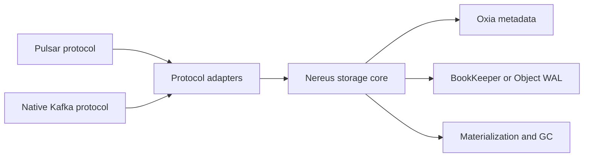

import DocBaseline from '@site/src/components/DocBaseline';

<DocBaseline product="Nereus" repository="nereusstream/nereus" authority="reader-facing-summary" commit="c820391dc1de4229362ddf833487066c32609cba" verified="2026-08-07" />

# Nereus documentation

Nereus is a shared stream storage layer beneath Pulsar and Native Kafka. Protocol brokers retain their protocol semantics; Nereus owns durable bytes, logical offsets, committed heads, physical generations, recovery, and safe reclamation.

This site follows the dependency order of the architecture model. Read the [overview](/docs/nereus/overview/why-nereus) first, then move through logical coordinates, WAL and commit, write/read paths, integrations, and operations.

:::info Documentation source

The initial migration is grounded in the local architecture snapshot **Nereus 当前架构与端到端流程**, generated from `nereusstream/nereus main@894fc4e4`. The page baseline is separately checked against the current Nereus `main@c820391d` on 2026-08-07. The [document baseline](/docs/nereus/reference/document-baseline) explains this distinction and the coverage map.

:::

## Start here

- [Why Nereus?](/docs/nereus/overview/why-nereus) — the boundary between protocol semantics and storage semantics.
- [Architecture](/docs/nereus/overview/architecture) — the layers, authorities, and source anchors.
- [Stream, record, entry, and offset](/docs/nereus/concepts/stream-record-entry-offset) — the coordinate model used by every adapter.
- [Current migration status](/docs/nereus/development/project-status) — what has been verified and what remains to migrate.
