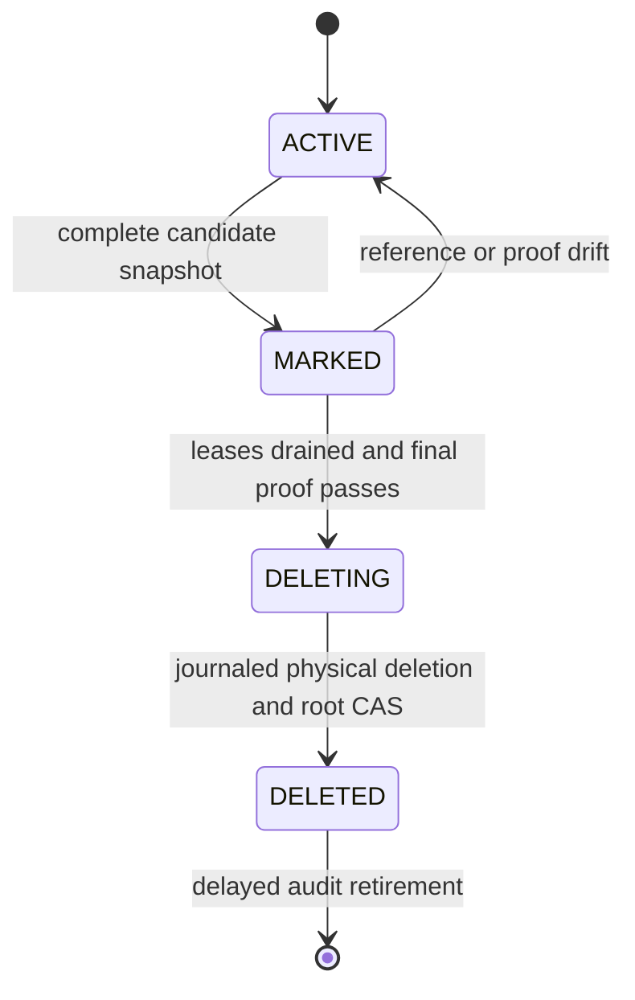

import DocBaseline from '@site/src/components/DocBaseline';

<DocBaseline product="Nereus" repository="nereusstream/nereus" authority="reader-facing-summary" commit="c820391dc1de4229362ddf833487066c32609cba" verified="2026-08-07" />

# Object GC state machine {#object-gc-state-machine}

Every physical Object identity has an authoritative Oxia root. The root records the object identity,
lifecycle epoch, state, owner/domain proofs, deletion journal reference, and metadata version. It
closes the race between a new reader/protection and a GC mark.

## Lifecycle {#lifecycle}

| State | New references | Required action |
| --- | --- | --- |
| `ACTIVE` | Allowed after create-protection -> reload-root -> same-epoch validation | Normal reads, tasks, and protection |
| `MARKED` | Frozen | Drain existing readers/tasks/owners; revert on any veto or drift |
| `DELETING` | Forbidden | Follow the sealed journal and recover response loss |
| `DELETED` | Forbidden | Keep audit root until delayed absence and reference proofs complete |

## Mark and drain {#mark-drain}

GC marks only after collecting a complete reference snapshot. Once marked, it rejects new references
and waits for existing reader leases, materialization tasks, owner sessions, and protection domains
to drain. If a new authoritative reference, root/version drift, owner/domain change, or incomplete
inventory appears, the root returns to `ACTIVE` or remains `MARKED`; it does not advance to deletion.

## Sealed deletion journal {#deletion-journal}

After all eligibility checks pass, GC persists a journal containing exact metadata keys, protections,
object identity, and operation order, then moves the root to `DELETING`:

1. Retire generation/source metadata.
2. Remove or retire protections.
3. Revalidate root and journal.
4. Execute Object DELETE.
5. Resolve provider response loss by exact HEAD/absence checks.
6. CAS the root to `DELETED`.

A new process can resume from the root and journal without the old JVM’s in-memory plan. If Object
DELETE or the final CAS response is lost, reload the exact root and physical identity and recognize an
already-applied operation rather than issuing an unrelated delete.

## Deleted roots and late bytes {#deleted-roots}

`DELETED` does not immediately mean the root can be erased. Retirement requires two sufficiently
separated exact absence observations, unchanged owner/domain proofs, retired references/manifests,
and a root-last conditional delete. If bytes later appear under the old key, the old root does not
revive. Inventory creates a new lifecycle root and subjects the bytes to orphan grace and full
identity review.

## Object listing is discovery only {#listing-boundary}

Object LIST can discover bytes that have no root, but it cannot prove that an object has no stream
reference, that a generation is retired, or that DELETE is safe. A missing-root object first receives
a root and orphan grace; only then can the ordinary GC state machine evaluate it.

## Source anchors {#source-anchors}

- [`PhysicalObjectGarbageCollector.java`](https://github.com/nereusstream/nereus/blob/c820391dc1de4229362ddf833487066c32609cba/nereus-materialization/src/main/java/com/nereusstream/materialization/gc/PhysicalObjectGarbageCollector.java)
- [`PhysicalGcLifecycleService.java`](https://github.com/nereusstream/nereus/blob/c820391dc1de4229362ddf833487066c32609cba/nereus-materialization/src/main/java/com/nereusstream/materialization/gc/PhysicalGcLifecycleService.java)
- [`PhysicalObjectRootScanner.java`](https://github.com/nereusstream/nereus/blob/c820391dc1de4229362ddf833487066c32609cba/nereus-materialization/src/main/java/com/nereusstream/materialization/gc/PhysicalObjectRootScanner.java)
- [`Future 4 reader retention and GC`](https://github.com/nereusstream/nereus/blob/c820391dc1de4229362ddf833487066c32609cba/docs/phase-4-compaction-generation/05-reader-retention-and-gc.md)
