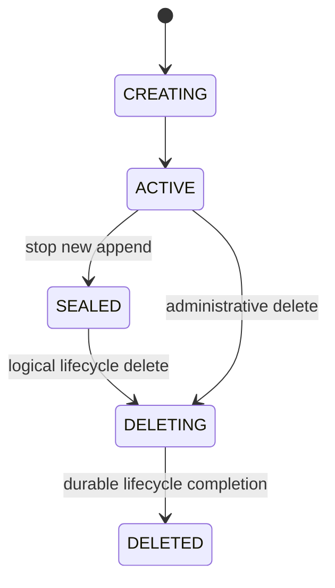

import DocBaseline from '@site/src/components/DocBaseline';

<DocBaseline commit="c820391dc1de4229362ddf833487066c32609cba" verified="2026-08-07" />

# Retention, trim, and source retirement {#retention-trim-source-retirement}

Nereus does not use “retention” as a synonym for deleting bytes. Four layers change four different
facts and must be reviewed independently.

## Four layers {#four-layers}

| Layer | Changes | Does not imply |
| --- | --- | --- |
| Consumer ack | A Pulsar cursor’s durable ack state; Kafka group offsets remain Kafka state | Stream trim or physical deletion |
| Logical trim | The stream’s readable lower bound; offsets below it return `OFFSET_TRIMMED` | Object/ledger bytes are gone |
| Source retirement | A generation, commit prefix, marker, or WAL range no longer serves read, recovery, repair, materialization, or retention references | The enclosing physical object can be deleted |
| Physical GC | Object DELETE or whole-ledger deletion after all references and leases drain | A new logical offset or protocol state |

Pulsar cursor protection floors participate in trim planning. Kafka consumer-group offsets do not
become a retention floor; Kafka’s retention policy may delete data that a group has not consumed.

## Logical trim {#logical-trim}

`trim(beforeOffset)` advances durable trim metadata. A read below the trim offset returns
`OFFSET_TRIMMED`; a physical object may still contain both trimmed and live ranges. Retaining the
bytes is normal while the object also covers an untrimmed range or while a reader, recovery
checkpoint, cursor snapshot, or materialization task still references it.

The trim coordinator must be fenced by the current stream owner/session and use a monotonic operation
deadline. A response-loss retry reloads the current trim value; the same target is idempotent and does
not advance the boundary twice.

## Source retirement proof {#source-retirement}

Retiring a source requires evidence that a healthy replacement, recovery checkpoint, trim boundary,
or view-specific coverage makes the old source unnecessary. The proof covers:

- ordinary reads and same-view fallback;
- append recovery and generation-0 index repair;
- materialization source protection;
- cursor, catalog, and recovery-checkpoint references;
- reader leases and physical-root lifecycle.

Retirement can remove metadata references while the enclosing object remains active because it still
contains another stream slice or a live range.

## Stream lifecycle {#stream-lifecycle}



`SEAL` blocks new appends but permits historical reads. The seal transition shares the per-stream
lane barrier with already-admitted appends, so the old writes complete before the state changes.
Logical stream deletion ends the protocol lifecycle; background GC later removes roots, references,
objects, and ledgers. Recreate obtains a new Pulsar projection incarnation or Kafka topic-ID binding,
so old physical bytes cannot be adopted by the new lifecycle.

## Safe defaults and activation {#safe-defaults}

Physical deletion is irreversible. The default runtime posture is:

```text
gc enabled = false
dryRun = true
```

An administrator switch is not deletion authority. Mutating GC additionally requires provider
capability canary, full root/stream/reference coverage, Broker readiness, a durable activation
record, an exact capability digest, and final revalidation immediately before mutation.

## Source anchors {#source-anchors}

- [`TrimCoordinator.java`](https://github.com/nereusstream/nereus/blob/c820391dc1de4229362ddf833487066c32609cba/nereus-core/src/main/java/com/nereusstream/core/trim/TrimCoordinator.java)
- [`NereusManagedLedgerRetentionService.java`](https://github.com/nereusstream/nereus/blob/c820391dc1de4229362ddf833487066c32609cba/nereus-managed-ledger/src/main/java/com/nereusstream/managedledger/retention/NereusManagedLedgerRetentionService.java)
- [`Future 4 reader retention and GC`](https://github.com/nereusstream/nereus/blob/c820391dc1de4229362ddf833487066c32609cba/docs/phase-4-compaction-generation/05-reader-retention-and-gc.md)
