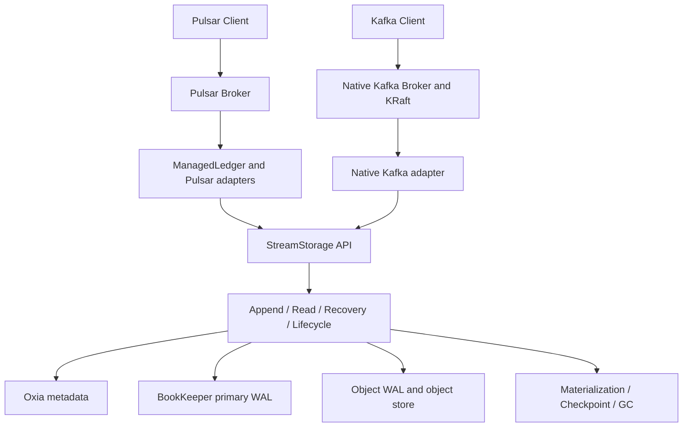

import DocBaseline from '@site/src/components/DocBaseline';

<DocBaseline product="Nereus" repository="nereusstream/nereus" authority="reader-facing-summary" commit="c820391dc1de4229362ddf833487066c32609cba" verified="2026-08-07" />

# Architecture {#architecture}

## Layered position {#layered-position}

Nereus is a shared storage core below protocol systems. The protocol entry points remain distinct, but both paths eventually use the same logical stream contract.



The diagram is a responsibility map, not a claim that every deployment enables every provider or adapter.

## Correctness authorities {#correctness-authorities}

| Concern | Authority | Meaning |
| --- | --- | --- |
| Logical visibility | Stream head and commit chain in metadata | Which ranges are committed and can be returned as normal stream data |
| Ownership and fencing | Session/epoch metadata | Which writer or broker may continue an operation |
| Physical bytes | BookKeeper or object store | Durable representations referenced by logical metadata |
| Read location | Offset index and generation index | A repairable mapping from logical ranges to physical targets |
| Materialization progress | Durable task/checkpoint metadata | Which source ranges are protected, published, or safe to retire |
| Protocol state | Pulsar metadata or Kafka KRaft/internal topics | Topic, partition, subscription, transaction, and leader semantics |

The physical stores never become logical truth just because a write, PUT, or delete returned successfully.

## Module boundaries {#module-boundaries}

The implementation is organized around dependency direction:

```text
protocol adapters
      ↓
managed-ledger / Kafka storage boundary
      ↓
StreamStorage core
      ↓
metadata, BookKeeper, object store, materialization
```

The core API speaks in `streamId`, offsets, append/read requests, protection, and lifecycle operations. It does not expose Pulsar ledger identity or Kafka segment identity as its primary coordinate.

## Broker lifecycle {#broker-lifecycle}

The broker is a protocol owner and an active client of Nereus, not the durable owner of stream bytes. A broker can open a stream, acquire a session, serve reads, or release its local resources. Another broker can recover from metadata and physical providers without first copying all bytes into the new broker.

This distinction is especially important for scale-in/out and failure recovery: ownership transfer changes who may act, while logical offsets and physical generations remain stable.

## Compatibility boundaries {#compatibility-boundaries}

- Pulsar and Native Kafka are separate protocol paths over the common storage core.
- KoP is a separate projection through the Pulsar boundary; it is not the Native Kafka runtime.
- A storage profile is selected at stream creation and is not an online physical migration switch.
- Advanced protocol semantics are documented only when the corresponding adapter contract and verification evidence exist.

## Source anchors {#source-anchors}

- [`docs/design/nereus-overall-architecture.md`](https://github.com/nereusstream/nereus/blob/c820391dc1de4229362ddf833487066c32609cba/docs/design/nereus-overall-architecture.md)
- [`docs/design/nereus-terminology.md`](https://github.com/nereusstream/nereus/blob/c820391dc1de4229362ddf833487066c32609cba/docs/design/nereus-terminology.md)
- [`docs/design/nereus-commit-protocol.md`](https://github.com/nereusstream/nereus/blob/c820391dc1de4229362ddf833487066c32609cba/docs/design/nereus-commit-protocol.md)
