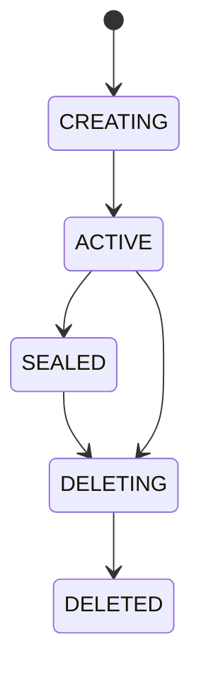
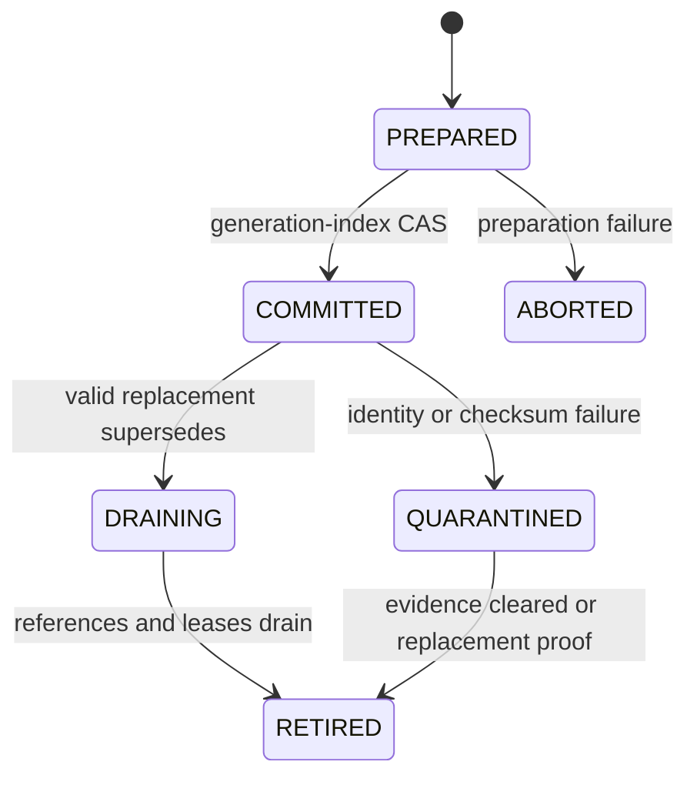
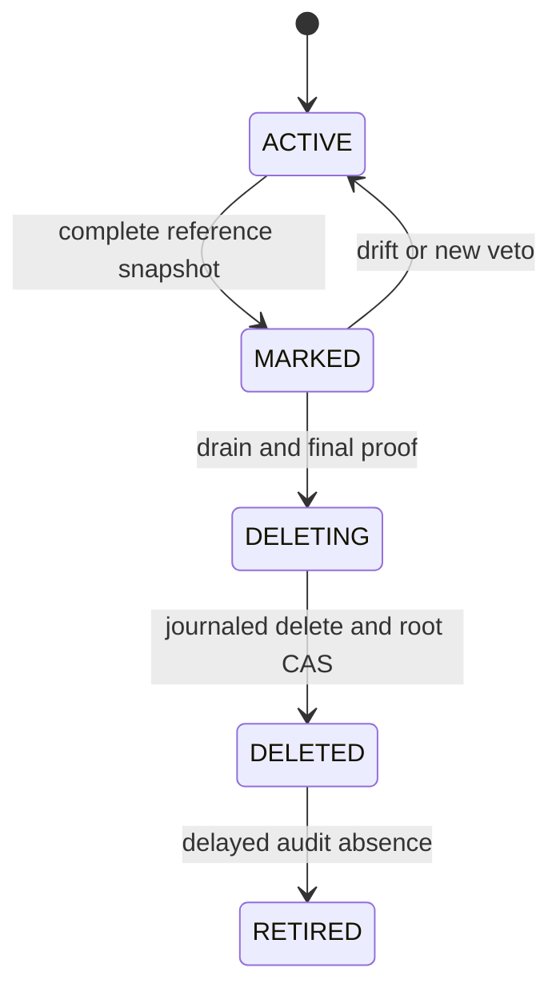

import DocBaseline from '@site/src/components/DocBaseline';

<DocBaseline product="Nereus" repository="nereusstream/nereus" authority="reader-facing-summary" commit="c820391dc1de4229362ddf833487066c32609cba" verified="2026-08-07" />

# State machines {#state-machines}

These compact machines show durable lifecycle boundaries. Workflow status does not automatically
change protocol visibility; the authority column remains decisive.

## Stream {#stream}



`ACTIVE` permits append/read, `SEALED` permits historical read but blocks new append, `DELETING`
blocks new ordinary operations, and `DELETED` is the logical terminal state while physical GC may
continue.

## Higher generation {#higher-generation}



Only `COMMITTED` index publication makes a generation a reader candidate.

## Physical Object root {#object-root}



Object LIST discovers possible orphans but cannot authorize a transition. A deletion journal makes
`DELETING` restartable after process or response failure.

## Append outcome {#append-outcome}

```text
KNOWN_NOT_COMMITTED  -> safe to start a new attempt
MAY_HAVE_COMMITTED   -> recover the original attempt and suspend the stream lane
KNOWN_COMMITTED      -> do not append again; finish index/Object completion or return the result
```

The outcome describes commit certainty and is orthogonal to timeout, fencing, and metadata-unavailable
error codes.

## Source anchors {#source-anchors}

- [`StreamState.java`](https://github.com/nereusstream/nereus/blob/c820391dc1de4229362ddf833487066c32609cba/nereus-api/src/main/java/com/nereusstream/api/StreamState.java)
- [`GenerationLifecycle.java`](https://github.com/nereusstream/nereus/blob/c820391dc1de4229362ddf833487066c32609cba/nereus-metadata-oxia/src/main/java/com/nereusstream/metadata/oxia/records/GenerationLifecycle.java)
- [`PhysicalGcMarkStatus.java`](https://github.com/nereusstream/nereus/blob/c820391dc1de4229362ddf833487066c32609cba/nereus-materialization/src/main/java/com/nereusstream/materialization/gc/PhysicalGcMarkStatus.java)
- [`AppendOutcome.java`](https://github.com/nereusstream/nereus/blob/c820391dc1de4229362ddf833487066c32609cba/nereus-api/src/main/java/com/nereusstream/api/AppendOutcome.java)
