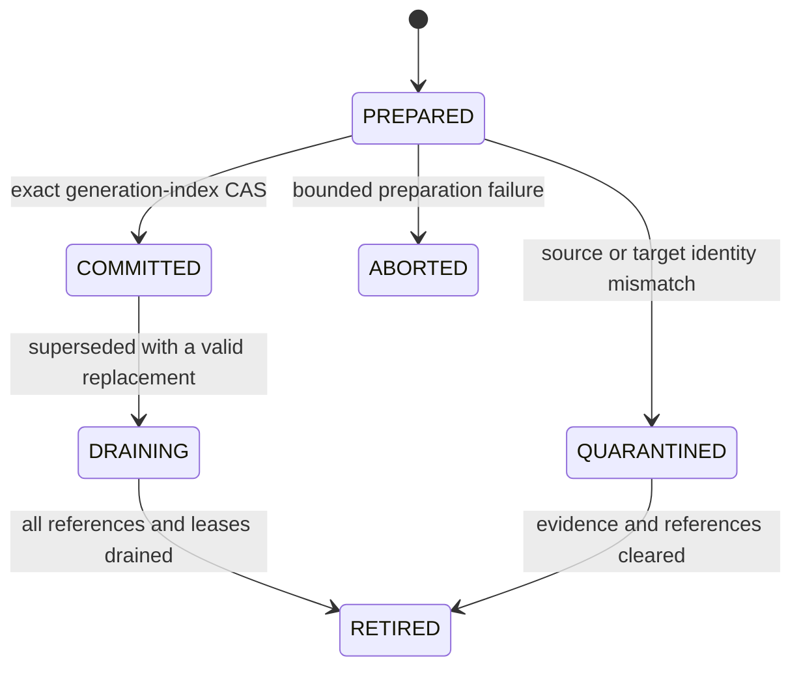

import DocBaseline from '@site/src/components/DocBaseline';

<DocBaseline commit="c820391dc1de4229362ddf833487066c32609cba" verified="2026-08-07" />

# Generation lifecycle {#generation-lifecycle}

Every physical replacement has a durable lifecycle. The lifecycle prevents an incomplete object or
stale task from becoming a reader target, and prevents GC from deleting a target that recovery or a
live reader still needs.

## States and transitions {#states}

| State | Reader visibility | Meaning |
| --- | --- | --- |
| `PREPARED` | Not eligible | Target and source proof are recorded, but publication has not succeeded |
| `COMMITTED` | Eligible after pin and revalidation | Exact generation-index CAS succeeded |
| `QUARANTINED` | Not eligible | Target or source identity failed validation; retain evidence for diagnosis/recovery |
| `DRAINING` | Existing pins only | No new reads select it; active leases and recovery references must drain |
| `RETIRED` | Not eligible | All retention, recovery, task, cursor, and reader references are gone |
| `ABORTED` | Not eligible | Preparation failed before publication and its temporary protection may be released |

The normal path is:

`COMMITTED` is the visibility boundary. An object-store PUT, BookKeeper flush, task completion, or
worker-local success is not a substitute for the conditional index publication.

## Publication contract {#publication-contract}

Before publishing a higher generation, the materialization worker must retain:

- the exact source index entries and their metadata versions/checksums;
- the source read view and half-open offset range;
- the output target identity, declared length, checksum, and format version;
- the generation sequence identity and task identity;
- the expected predecessor/index version used for the conditional update.

The publisher revalidates those identities immediately before the CAS. If the source changed,
overlaps a newer publication, or the target is not immutable, the output is quarantined or the task
is retried with a fresh snapshot. It must not publish based on an old object listing or a stale
planner hint.

Retries are idempotent: the same task and output identity may be observed again, but a generation
number is not recycled for a different target.

## Retirement and physical GC {#retirement}

After a valid replacement is published, the old generation may be marked `DRAINING`, but deletion is
still deferred. The GC authority must account for all of these references:

- reader pins and read leases;
- append recovery attempts and generation-0 repair;
- materialization tasks and retry checkpoints;
- cursor/snapshot retention references;
- stream trim and catalog/reference checkpoints.

A generation can reach `RETIRED` only after a fresh reference scan proves that none of those owners
can resolve it again. Object storage listing is only an orphan-discovery aid; the durable reference
roots and generation index decide whether bytes are still needed.

## Recovery checkpoint rule {#recovery-checkpoint}

Recovery may replay the append-time target until a replacement index and its proof are durably
installed. Once a checkpoint records that the replacement covers the source range, the checkpoint
must be atomically advanced with the corresponding identity. A stale checkpoint cannot justify
retiring generation 0, and an incomplete checkpoint cannot be treated as a successful replacement.

## Source anchors {#source-anchors}

- [`GenerationId.java`](https://github.com/nereusstream/nereus/blob/c820391dc1de4229362ddf833487066c32609cba/nereus-api/src/main/java/com/nereusstream/api/GenerationId.java)
- [`Future 4 metadata and publication`](https://github.com/nereusstream/nereus/blob/c820391dc1de4229362ddf833487066c32609cba/docs/phase-4-compaction-generation/03-oxia-metadata-and-publication.md)
- [`Future 4 reader retention and GC`](https://github.com/nereusstream/nereus/blob/c820391dc1de4229362ddf833487066c32609cba/docs/phase-4-compaction-generation/05-reader-retention-and-gc.md)
- [`Future 4 task recovery`](https://github.com/nereusstream/nereus/blob/c820391dc1de4229362ddf833487066c32609cba/docs/phase-4-compaction-generation/04-task-recovery-async-and-checkpoint.md)
