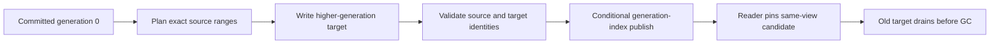

import DocBaseline from '@site/src/components/DocBaseline';

<DocBaseline product="Nereus" repository="nereusstream/nereus" authority="reader-facing-summary" commit="c820391dc1de4229362ddf833487066c32609cba" verified="2026-08-07" />

# Generation overview {#generation-overview}

Generation is a physical representation number for one stream and one read view. It lets Nereus
replace a multi-stream WAL slice with a read-optimized object while keeping the protocol coordinate
`streamId + offset` unchanged.

## What generation means {#meaning}

For a resolved range, the useful identity is:

```text
(streamId, readView, offset range, generation, exact ReadTarget identity)
```

Generation `0` is the append-time representation. Higher generations are materialized from exact
committed source ranges and become readable only after their generation-index record is durably
published. Generation is not any of the following:

- a logical offset or `committedEndOffset`;
- an append `commitVersion`;
- a Kafka producer epoch or a Pulsar topic incarnation;
- an object-store version, replica count, or retry counter.

`GenerationId` is non-negative and view-scoped. Values are monotonically allocated and are never
reused within the same `(stream, read view)` namespace, even when a generation is later quarantined
or retired.

## Read views are separate namespaces {#read-views}

Nereus keeps physical layout replacement separate from semantic topic compaction:

| Read view | Meaning | Density rule |
| --- | --- | --- |
| `COMMITTED` | Lossless representation of every committed offset | Dense coverage of the committed range |
| `TOPIC_COMPACTED` | Key-aware semantic projection | May be sparse; coverage is explicit |

A higher generation in `TOPIC_COMPACTED` can never become the fallback for a `COMMITTED` read. The
same-view constraint is part of the read resolver contract, not merely a ranking preference.

## Publication is an index operation {#publication}

Writing an object, completing a task, or seeing an object in a bucket does not make a generation
visible. Publication must validate the source snapshot and perform the conditional generation-index
update for the exact stream, view, range, generation, target identity, checksum, and metadata
version. Readers consider only `COMMITTED` index records with a valid target and a covering range.



The append head remains the authority for logical visibility. Generation publication only changes
which physical target a read may select.

## Generation 0 repair {#generation-zero-repair}

Generation 0 is recoverable from the committed head, commit intent, and durable physical evidence.
If a reader finds a committed offset with no usable generation-0 index record, the `COMMITTED` read
path performs bounded index repair and retries resolution. If the repair proves that the requested
offset was trimmed, it returns `OFFSET_TRIMMED`; it must not turn a repair timeout into a permanent
negative cache entry.

## Source anchors {#source-anchors}

- [`GenerationId.java`](https://github.com/nereusstream/nereus/blob/c820391dc1de4229362ddf833487066c32609cba/nereus-api/src/main/java/com/nereusstream/api/GenerationId.java)
- [`GenerationReadResolver.java`](https://github.com/nereusstream/nereus/blob/c820391dc1de4229362ddf833487066c32609cba/nereus-core/src/main/java/com/nereusstream/core/read/GenerationReadResolver.java)
- [`Future 4 compaction and generation`](https://github.com/nereusstream/nereus/blob/c820391dc1de4229362ddf833487066c32609cba/docs/design/nereus-future4-compaction-generation.md)
