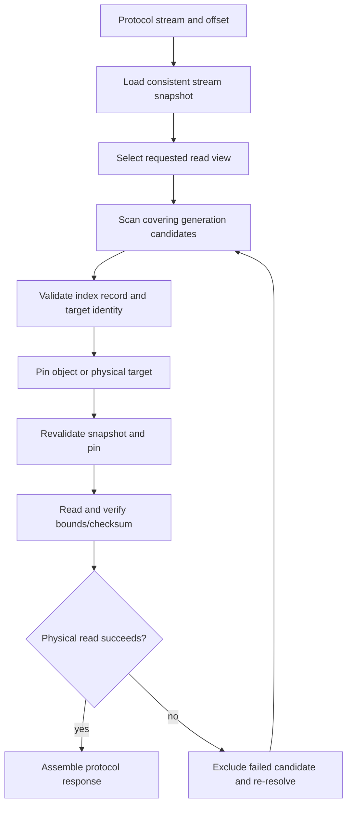

import DocBaseline from '@site/src/components/DocBaseline';

<DocBaseline commit="c820391dc1de4229362ddf833487066c32609cba" verified="2026-08-07" />

# Generation selection and fallback {#generation-selection-and-fallback}

The read resolver chooses a physical target for one logical request. It does not infer visibility
from object names, choose the highest number across views, or keep a stale answer after a target
failure.

## Resolution pipeline {#pipeline}

The resolver first checks stream snapshot, committed end, trim state, and read view. It then admits
only candidates whose range covers the requested offset, whose index record is valid, and whose
physical identity can be pinned. A candidate is not safe merely because its generation number is
larger.

## Candidate ordering and identity {#candidate-ordering}

Within one `(streamId, readView)` namespace, newer healthy generations are preferred. The candidate
retains the index key, index metadata version, index-record checksum, exact resolved range, and—when
needed—a publication identity. That identity is passed to the physical reader so a key reuse or
object replacement cannot silently return different bytes.

The resolver rechecks the relevant metadata after pinning. If the index changed, the pin failed, or
the physical identity no longer matches, it releases the pin and resolves again under the remaining
deadline.

## Same-view fallback only {#same-view-fallback}

If the newest candidate is unavailable, the resolver excludes that exact candidate and tries an older
candidate in the same read view. It never falls from `TOPIC_COMPACTED` to `COMMITTED` or the reverse:
the two views have different coverage and semantics.

If all candidates fail, the read returns a retryable resolution/read error with the original deadline
and diagnostic context. A physical failure invalidates a positive cache entry, but it does not create
a permanent negative cache entry for a committed offset.

## Repair and boundary outcomes {#repair}

For `COMMITTED`, an absent generation-0 index may trigger bounded repair from authoritative metadata
and append evidence. Repair is allowed to replace stale index proof and then retry the same resolve.
If repair proves that trim passed the requested offset, the result is `OFFSET_TRIMMED`; if the
offset is at or beyond the committed end, the normal result is EOF. These outcomes remain distinct
from “a candidate temporarily failed to open”.

For `TOPIC_COMPACTED`, sparse coverage is part of the view contract. A missing compacted record is
not permission to manufacture a dense offset range or to read the committed view as a fallback.

## Source anchors {#source-anchors}

- [`GenerationReadResolver.java`](https://github.com/nereusstream/nereus/blob/c820391dc1de4229362ddf833487066c32609cba/nereus-core/src/main/java/com/nereusstream/core/read/GenerationReadResolver.java)
- [`GenerationReadCandidate.java`](https://github.com/nereusstream/nereus/blob/c820391dc1de4229362ddf833487066c32609cba/nereus-core/src/main/java/com/nereusstream/core/read/GenerationReadCandidate.java)
- [`ReadTargetDispatcher.java`](https://github.com/nereusstream/nereus/blob/c820391dc1de4229362ddf833487066c32609cba/nereus-core/src/main/java/com/nereusstream/core/read/ReadTargetDispatcher.java)
- [`Future 4 reader retention and GC`](https://github.com/nereusstream/nereus/blob/c820391dc1de4229362ddf833487066c32609cba/docs/phase-4-compaction-generation/05-reader-retention-and-gc.md)
