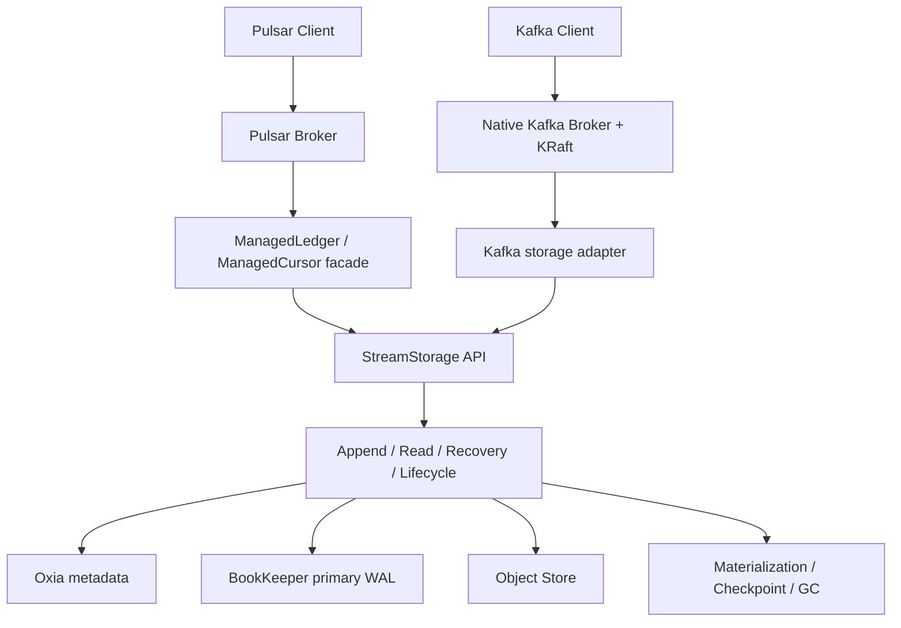

# 总体建议

不要在现有 `index.html` 上继续增加一个独立的 `docs.html`，也不要把 129 页 PDF 直接嵌进网页。更合适的方案是：

1. **把站点整体迁移到 Docusaurus 3。**
2. **首页保留为简洁的项目入口。**
3. **所有架构、流程、协议接入和运行机制进入 `/docs`。**
4. **顶部导航删除 Architecture、Profiles、Status、Features、Roadmap、Get Started，只保留 Docs 和必要工具项。**
5. **以后以 Markdown/MDX 作为文档唯一源文件，PDF改为从网站文档生成的发布快照。**

当前 Nereus 首页的导航、样式、各个区块以及中英文切换主要都集中在一个较大的 `index.html` 里；继续扩展会导致首页、文档、翻译和样式越来越难维护。

> **实施同步（2026-08-07）**：第一阶段已开始实施。站点已建立 Docusaurus 3.10.2、TypeScript、Mermaid、显式 sidebar 和 GitHub Pages 构建/部署工作流；原静态首页已归档到 `legacy/index.html`，活动首页改为 `src/pages/index.tsx`。Overview、Concepts、项目状态和文档基线页面已落地，PDF 覆盖表位于 `migration/pdf-content-map.yml`。当前网页文档基线为 `nereus main@c820391d`（2026-08-07 核验），PDF 输入快照仍标记为 `nereus main@894fc4e`（2026-08-04 生成）；覆盖表中的 pending 项不能被视为已迁移。下一阶段继续实现 Append/Recovery、Storage Profile、Generation 和 Read 文档，并在每个稳定增量后同步更新本段与覆盖表。

`pulsar-site` 已经采用 Docusaurus 3.10.2、React、文档插件、显式侧边栏、文档版本、Mermaid、Algolia 搜索和模块化首页组件。Nereus 应对齐这些能力，但不需要复制 Pulsar 的多文档实例、ASF 页面、复杂预处理器和大量历史兼容逻辑。

---

# 一、应该与 `pulsar-site` 对齐到什么程度

建议分成三层对齐。

| 层次   | Nereus 应该对齐的内容                                         | 不应直接复制的内容                                               |
| ---- | ------------------------------------------------------ | ------------------------------------------------------- |
| 工程框架 | Docusaurus 3、TypeScript、React、Markdown/MDX、CSS Modules | Pulsar 的全部依赖、MUI、Bootstrap、历史 jQuery 代码                 |
| 文档体验 | `/docs` 路由、左侧目录、右侧页面目录、上一页/下一页、Edit this page、搜索、语言切换  | Pulsar 数百篇文档的目录规模                                       |
| 发布治理 | PR 构建检查、GitHub Pages 自动部署、稳定 URL、后续版本化                 | ASF 专用 Footer、Apache 发布流程、多版本并行构建脚本                     |
| 首页结构 | React 组件化、统一 Layout、移动端导航                              | 对 Pulsar 首页进行像素级复制                                      |
| 内容组织 | Overview、Concepts、Architecture、Operations、Reference    | Client Libraries、Functions、IO、Use Cases 等与 Nereus 无关的分类 |

技术版本可以先直接跟随 Pulsar 当前基线：

* Docusaurus `3.10.2`
* Node.js `>=22`
* React 18
* TypeScript
* `@docusaurus/preset-classic`
* `@docusaurus/theme-mermaid`

但不要引入 Pulsar 站点中与 Nereus 无关的 Bootstrap、MUI、轮播图、多个 docs plugin 和自定义 Markdown 预处理器。

---

# 二、顶部导航具体怎么改

## 2.1 最终导航结构

第一阶段建议变成：

```text
[Nereus Logo]  Docs                         Search  中文/English  GitHub
```

其中：

* Logo 点击回首页。
* `Docs` 点击进入 `/docs`。
* Search 在文档内容上线后加入。
* 中文/English 使用 Docusaurus 的 locale dropdown。
* GitHub 保留图标，不需要文字也可以。
* 当前不要显示版本下拉框；等 `v0.1.0` 正式发布后再加入。

顶部不再放：

```text
Architecture
Profiles
Status
Features
Roadmap
Get Started
```

这些内容重新安排如下。

| 当前导航         | 新位置                                                        |
| ------------ | ---------------------------------------------------------- |
| Architecture | 首页保留一个简化架构图，完整内容进入 `/docs/overview/architecture`           |
| Profiles     | 首页保留五种 Profile 的摘要，完整内容进入 `/docs/storage/storage-profiles` |
| Status       | 首页底部保留一张简短状态卡，详细状态进入 `/docs/project/status`                |
| Features     | 合并到首页 “Why Nereus” 和 `/docs/overview/why-nereus`           |
| Roadmap      | 放到 GitHub Projects、Milestones 或单独的项目状态页，不占主导航              |
| Get Started  | 暂时不展示；真正具备安装、配置、验证文档后再加入                                   |

这份 PDF 的范围是架构、逻辑 offset、提交协议、generation、Pulsar/Kafka 接入、恢复和 GC，并不是安装或部署 Quickstart。不要为了模仿 Pulsar 而先制造一个内容不完整的 “Get Started”。

## 2.2 Docusaurus 导航配置

初期可以这样配置：

```ts
navbar: {
  title: '',
  logo: {
    alt: 'Nereus',
    src: 'img/nereus-logo.svg',
  },
  items: [
    {
      type: 'docSidebar',
      sidebarId: 'docsSidebar',
      label: 'Docs',
      position: 'left',
    },
    {
      type: 'localeDropdown',
      position: 'right',
    },
    {
      href: 'https://github.com/nereusstream/nereus',
      position: 'right',
      className: 'header-github-link',
      'aria-label': 'Nereus GitHub repository',
    },
  ],
},
```

正式发布多个文档版本后再加入：

```ts
{
  type: 'docsVersionDropdown',
  position: 'right',
}
```

使用 `docSidebar` 而不是写死 `/docs/xxx`，可以让 Docs 自动进入当前语言和当前文档版本对应的首页。

---

# 三、首页应该重新设计成什么样

首页不再承担完整文档职责。它应该回答四个问题：

1. Nereus 是什么。
2. Nereus 解决什么问题。
3. 它的核心模型是什么。
4. 从哪里开始阅读。

PDF 对 Nereus 的总体定位已经比较准确：Nereus 不是新消息协议，也不只是“把 BookKeeper 换成 S3”，而是位于 Pulsar 或 Kafka Broker 下方的共享流存储层；协议系统继续负责 Topic、订阅、事务和 Leader，Nereus 负责字节存放、offset 提交、恢复、物理演进和数据回收。

## 3.1 推荐首页顺序

### 第一屏：Hero

```text
Nereus

Shared stream storage for Pulsar and Native Kafka

Pulsar and Kafka retain their protocol semantics.
Nereus manages durable bytes, committed offsets,
recovery, physical generations, and safe reclamation.

[Read the docs] [GitHub]
```

当前首页 Hero 中的 `F1-F4`、`F9`、`146/146` 等开发状态不应继续占据首屏。这些信息变化频繁，会让首页变成阶段报告，而不是长期稳定的项目入口。

可以在标题下保留一个较弱的状态标签：

```text
v0.1.0 — Testing
```

### 第二屏：What Nereus does

放一张简化后的总体架构图：



这张图对应 PDF 中协议入口、兼容层、StreamStorage、Oxia、BookKeeper、Object Store 和后台物化的总体关系。

### 第三屏：三个核心不变量

只展示最重要的三个概念：

#### Stable logical coordinates

```text
streamId + offset
```

物理数据可以迁移，但协议坐标和逻辑 offset 不改变。

#### One logical commit point

```text
stream head version-CAS
```

BookKeeper 写成功、Object PUT 成功都不等于逻辑提交成功。

#### Physical evolution through generations

同一段逻辑 offset 可以拥有多个物理表示，但消息顺序和 offset 保持不变。

这三项比当前首页上的模块数量、测试数字更适合作为长期首页内容。

### 第四屏：Storage Profiles

首页只展示一个简化矩阵：

| Primary WAL             | Producer 返回边界                                       | 后续对象化                     |
| ----------------------- | --------------------------------------------------- | ------------------------- |
| Object WAL Sync         | Head + generation-0 index                           | 可继续生成更优 Object generation |
| Object WAL Async        | Stable head                                         | 后台修复 index 并优化对象布局        |
| BookKeeper Only         | Stable head                                         | 不生成消息数据 Object generation |
| BookKeeper Async Object | Stable head                                         | 后台从 BK 转为 Object          |
| BookKeeper Sync Object  | Stable head + BK index + required Object generation | 返回前完成 Object generation   |

PDF 当前明确列出了这五种 canonical profile。

首页卡片点击后统一进入：

```text
/docs/storage/storage-profiles
```

### 第五屏：Explore the documentation

建议放四张入口卡片：

| 卡片                         | 链接                                          |
| -------------------------- | ------------------------------------------- |
| Concepts and Architecture  | `/docs/concepts/stream-record-entry-offset` |
| Write and Read Paths       | `/docs/data-paths/append-flow`              |
| Pulsar and Native Kafka    | `/docs/integrations/pulsar`                 |
| Recovery, Retention and GC | `/docs/operations/retention-and-gc`         |

### 第六屏：Current status

只保留：

```text
Current stage: v0.1.0 testing
Pulsar integration: available
Native Kafka integration: initial compatibility boundary
Storage profiles: 5
```

详细测试数量、commit、验证报告都放进 Project Status 页面。

---

# 四、PDF 应如何拆成网站文档

## 4.1 不要“一章一个超长页面”

这份 PDF 有 21 章和多个附录。它的阅读顺序是刻意安排的：

1. 先讲协议语义和存储语义为什么要分开。
2. 再讲 stream、record、entry、offset。
3. 然后讲 WAL、head、CAS、commit 和恢复。
4. 在理解逻辑提交后再讲 generation。
5. 最后进入 Pulsar、Kafka、cursor、checkpoint、trim 和 GC。

网站侧边栏必须保留这个知识依赖关系，不能简单按文件名字母顺序排列，也不适合把第 9 章 Generation 的十几页内容全部塞进一个页面。

建议拆成大约 30 到 35 个文档页面。

## 4.2 推荐目录

```text
docs/
├── index.mdx
│
├── overview/
│   ├── why-nereus.md
│   ├── architecture.md
│   └── reading-guide.md
│
├── concepts/
│   ├── stream-record-entry-offset.md
│   ├── protocol-logical-physical-coordinates.md
│   ├── primary-wal.md
│   ├── stream-head-and-commit-chain.md
│   ├── cas-and-linearization-point.md
│   └── read-target-and-offset-index.md
│
├── data-paths/
│   ├── append-flow.md
│   ├── append-outcomes.md
│   ├── append-recovery.md
│   ├── read-flow.md
│   ├── read-boundaries.md
│   └── index-repair-and-fallback.md
│
├── storage/
│   ├── storage-profiles.md
│   ├── object-wal.md
│   ├── bookkeeper-wal.md
│   ├── generation-overview.md
│   ├── generation-lifecycle.md
│   ├── generation-selection-and-fallback.md
│   └── materialization.md
│
├── integrations/
│   ├── pulsar.md
│   ├── pulsar-cursor-and-subscription.md
│   ├── native-kafka.md
│   ├── kafka-produce-and-fetch.md
│   ├── kafka-recovery-and-compaction.md
│   └── kop-vs-native-kafka.md
│
├── operations/
│   ├── retention-and-gc.md
│   ├── object-gc-state-machine.md
│   ├── bookkeeper-retention.md
│   ├── failure-and-recovery.md
│   ├── backpressure-and-timeouts.md
│   ├── observability.md
│   └── security-and-multitenancy.md
│
├── examples/
│   ├── pulsar-object-wal-sync.md
│   ├── pulsar-bookkeeper-async-object.md
│   ├── bookkeeper-sync-object-timeout.md
│   └── kafka-transaction-and-delete-records.md
│
├── development/
│   ├── module-boundaries.md
│   ├── source-reading-map.md
│   └── project-status.md
│
└── reference/
    ├── correctness-authorities.md
    ├── glossary.md
    ├── state-machines.md
    ├── end-to-end-cheatsheet.md
    ├── non-goals.md
    └── document-baseline.md
```

## 4.3 PDF 章节到网站目录的映射

| PDF 内容                               | 网站目标                                                              |
| ------------------------------------ | ----------------------------------------------------------------- |
| 第 1～2 章：阅读说明、为什么需要 Nereus            | `overview/`                                                       |
| 第 3 章：stream、record、entry、offset     | `concepts/stream-record-entry-offset.md` 等                        |
| 第 4 章：WAL、head、commit、CAS、ReadTarget | `concepts/primary-wal.md` 到 `read-target-and-offset-index.md`     |
| 第 5～6 章：append、结果不确定和恢复              | `data-paths/append-*`                                             |
| 第 7～8 章：Profile、Object WAL、BK WAL    | `storage/storage-profiles.md`、`object-wal.md`、`bookkeeper-wal.md` |
| 第 9 章：Generation                     | 拆成 overview、lifecycle、selection/fallback 三页                       |
| 第 10 章：通用读路径                         | `data-paths/read-*`                                               |
| 第 11 章：Pulsar 接入                     | `integrations/pulsar*`                                            |
| 第 12 章：Native Kafka 接入               | `integrations/native-kafka*`                                      |
| 第 13 章：后台物化                          | `storage/materialization.md`                                      |
| 第 14～17 章：GC、恢复、背压、安全                | `operations/`                                                     |
| 第 18 章：正确性所有者                        | `reference/correctness-authorities.md`                            |
| 第 19 章：代码模块                          | `development/module-boundaries.md`                                |
| 第 20 章：四个端到端示例                       | `examples/`                                                       |
| 第 21 章：Non-goals                     | `reference/non-goals.md`                                          |
| 附录 A～E                               | `reference/` 和 `development/source-reading-map.md`                |

PDF 本身已经覆盖了写、读、物化和 GC 的一页式速查流程，这一部分非常适合直接转换成 Reference 页面。

---

# 五、必须建立“迁移覆盖表”，避免遗漏 PDF 内容

由于 PDF 很长，单纯复制粘贴很容易遗漏小节。建议在仓库增加一个不参与站点渲染的文件：

```text
migration/pdf-content-map.yml
```

示例：

```yaml
source:
  title: Nereus 当前架构与端到端流程
  repository: nereusstream/nereus
  commit: 894fc4e4d9afcfd5ec14c2bde336106b85c2a151
  verified: 2026-08-04

sections:
  - source: "2.1-2.3"
    target:
      - "docs/overview/why-nereus.md"
      - "docs/overview/architecture.md"
    status: migrated

  - source: "3.1-3.7"
    target:
      - "docs/concepts/stream-record-entry-offset.md"
      - "docs/concepts/protocol-logical-physical-coordinates.md"
    status: migrated

  - source: "9.1-9.20"
    target:
      - "docs/storage/generation-overview.md"
      - "docs/storage/generation-lifecycle.md"
      - "docs/storage/generation-selection-and-fallback.md"
    status: in-progress

  - source: "Appendix A"
    target:
      - "docs/reference/glossary.md"
    status: pending
```

最终要求：

```yaml
unmapped_sections: []
unmapped_figures: []
unmapped_tables: []
```

迁移规则应是：

* 每一个 PDF 标题都必须映射到一个网站标题或明确的交叉引用。
* 每一个实质性结论都必须保留。
* 重复背景可以移动到统一页面，但不能静默删除。
* 所有图和表单独登记。
* “代码当前边界”和 “non-goal” 不得因为营销需要而删掉。

PDF 明确以 `nereus main@894fc4e4...` 为基线，并记录了 2026-08-04 的验证日期，因此网站文档也必须显示基线，而不能让读者误以为它永远自动对应最新 main。

---

# 六、每个文档页面的统一格式

建议每个页面都采用下面的结构。

## 6.1 Front matter

```md
---
title: Generation
description: How Nereus represents the same logical offset range using multiple physical layouts.
sidebar_position: 4
slug: /storage/generation
source_commit: 894fc4e4d9afcfd5ec14c2bde336106b85c2a151
last_verified: 2026-08-04
status: current-main
---
```

URL、文档 ID 和 heading ID 建议统一使用英文。页面标题和正文可以本地化。

## 6.2 页面正文模板

```mdx
import DocBaseline from '@site/src/components/DocBaseline';

<DocBaseline
  commit="894fc4e4d9afcfd5ec14c2bde336106b85c2a151"
  verified="2026-08-04"
/>

# Generation

## What problem does it solve? {#problem}

先从为什么需要这个概念讲起。

## Definition {#definition}

给出正式定义。

## What it is not {#not-this}

解释它不是 offset、commitVersion、Leader epoch 等。

## Normal flow {#normal-flow}

正常执行流程。

## Failure and recovery {#failure-recovery}

发生响应丢失、对象损坏或 Broker 切换时如何恢复。

## Source anchors {#source-anchors}

- `GenerationReadResolver.java`
- `GenerationLifecycle.java`
- `docs/phase-4-compaction-generation/README.md`

## Related topics {#related-topics}

- [Read path](../data-paths/read-flow.md)
- [Materialization](./materialization.md)
- [Retention and GC](../operations/retention-and-gc.md)
```

## 6.3 建议新增的 MDX 组件

不需要大量复杂组件，先做下面几个即可：

```text
DocBaseline
ArchitectureDiagram
FlowSteps
ProfileMatrix
AuthorityTable
StateMachine
SourceLinks
CompatibilityBoundary
```

其中 `CompatibilityBoundary` 用来突出：

```text
Supported
Experimental
Current limitation
Non-goal
```

这样 Native Kafka 的 RF=1 初始边界、在线 Profile 迁移未支持等内容不会埋在正文深处。

---

# 七、PDF 中的图表应该怎样转换

不要直接截取 PDF 页面作为图片。PDF 截图会有几个问题：

* 小屏幕无法阅读。
* 文本不可搜索。
* 无法适配暗色模式。
* 无法单独链接某个节点。
* 中文和英文版本无法分别翻译。

建议至少重画七张核心图：

| PDF 图                         | 网站形式                      |
| ----------------------------- | ------------------------- |
| Nereus 在 Pulsar 和 Kafka 下的位置  | 首页 SVG + Docs Mermaid     |
| 通用 Append 流程                  | Mermaid flowchart         |
| Generation 演进                 | Mermaid flowchart         |
| 通用 Read 流程                    | Mermaid flowchart         |
| Pulsar projection 与 MessageId | Mermaid                   |
| Kafka binding 与 ranged entry  | Mermaid                   |
| Object physical root 删除状态机    | Mermaid `stateDiagram-v2` |

PDF 中的通用 Append 流程已经明确从协议 payload、profile 检查、stream lane、WAL、protection、commit intent、head CAS 到完成边界。

Read 流程也已经明确划分了坐标转换、snapshot、generation 解析、reader pin、物理读取和协议结果组装。

Generation 图需要保留“同一个逻辑区间、多个物理表示、旧 generation 不立即删除”的关系。

Docusaurus 官方支持通过 `@docusaurus/theme-mermaid` 直接渲染 Mermaid，Pulsar 当前配置也已经启用了 Mermaid。([Docusaurus][1])

复杂架构图可以使用 SVG，但应保留 `.mmd`、`.drawio` 或其他可编辑源文件，例如：

```text
static/diagrams/
├── architecture-overview.svg
├── architecture-overview.drawio
├── generation-evolution.svg
└── generation-evolution.mmd
```

---

# 八、工程目录建议

站点仓库可以重构成：

```text
nereusstream.github.io/
├── docs/
├── i18n/
│   └── zh-Hans/
│       ├── docusaurus-plugin-content-docs/
│       ├── docusaurus-theme-classic/
│       └── code.json
│
├── src/
│   ├── components/
│   │   ├── home/
│   │   │   ├── Hero/
│   │   │   ├── ArchitectureOverview/
│   │   │   ├── CoreInvariants/
│   │   │   ├── StorageProfiles/
│   │   │   ├── DocsExplorer/
│   │   │   └── ProjectStatus/
│   │   ├── DocBaseline/
│   │   ├── ProfileMatrix/
│   │   ├── AuthorityTable/
│   │   └── SourceLinks/
│   │
│   ├── data/
│   │   ├── storageProfiles.ts
│   │   └── projectStatus.ts
│   │
│   ├── pages/
│   │   └── index.tsx
│   │
│   └── css/
│       └── custom.css
│
├── static/
│   ├── img/
│   ├── diagrams/
│   └── pdf/
│
├── migration/
│   └── pdf-content-map.yml
│
├── docusaurus.config.ts
├── sidebars.ts
├── package.json
├── tsconfig.json
├── yarn.lock
└── .github/
    └── workflows/
        └── pages.yml
```

首页组件应像 Pulsar 一样拆分，而不是再次形成一个几百行的 `HomePage.tsx`。Pulsar 首页当前已经把 Features、HowPulsarWorks、Users、ShortInfo 等拆成独立组件。

---

# 九、Docusaurus 配置建议

一个适合 Nereus 首期的配置大致如下：

```ts
import type {Config} from '@docusaurus/types';
import type {
  Options,
  ThemeConfig,
} from '@docusaurus/preset-classic';

const config: Config = {
  title: 'Nereus',
  tagline: 'Shared stream storage for Pulsar and Native Kafka',

  url: 'https://nereusstream.github.io',
  baseUrl: '/',

  organizationName: 'nereusstream',
  projectName: 'nereusstream.github.io',

  trailingSlash: true,
  onBrokenLinks: 'throw',

  markdown: {
    mermaid: true,
    hooks: {
      onBrokenMarkdownLinks: 'throw',
    },
  },

  i18n: {
    defaultLocale: 'en',
    locales: ['en', 'zh-Hans'],
  },

  themes: ['@docusaurus/theme-mermaid'],

  presets: [
    [
      'classic',
      {
        docs: {
          path: 'docs',
          routeBasePath: 'docs',
          sidebarPath: require.resolve('./sidebars.ts'),
          editUrl:
            'https://github.com/nereusstream/nereusstream.github.io/edit/master/',
          showLastUpdateAuthor: true,
          showLastUpdateTime: true,
          editLocalizedFiles: true,
        },

        blog: false,

        theme: {
          customCss: require.resolve('./src/css/custom.css'),
        },
      } satisfies Options,
    ],
  ],

  themeConfig: {
    navbar: {
      title: '',
      logo: {
        alt: 'Nereus',
        src: 'img/nereus-logo.svg',
      },
      items: [
        {
          type: 'docSidebar',
          sidebarId: 'docsSidebar',
          label: 'Docs',
          position: 'left',
        },
        {
          type: 'localeDropdown',
          position: 'right',
        },
        {
          href: 'https://github.com/nereusstream/nereus',
          position: 'right',
          className: 'header-github-link',
          'aria-label': 'GitHub repository',
        },
      ],
    },

    docs: {
      sidebar: {
        hideable: true,
        autoCollapseCategories: true,
      },
    },

    footer: {
      style: 'dark',
      links: [
        {
          title: 'Documentation',
          items: [
            {
              label: 'Overview',
              to: '/docs',
            },
            {
              label: 'Architecture',
              to: '/docs/overview/architecture',
            },
          ],
        },
        {
          title: 'Project',
          items: [
            {
              label: 'GitHub',
              href: 'https://github.com/nereusstream/nereus',
            },
            {
              label: 'Issues',
              href: 'https://github.com/nereusstream/nereus/issues',
            },
          ],
        },
      ],
      copyright:
        `Copyright © ${new Date().getFullYear()} NereusStream.`,
    },
  } satisfies ThemeConfig,
};

export default config;
```

因为这是组织主页仓库，GitHub Pages 地址位于站点根路径，因此应使用 `baseUrl: '/'`，而不是 `/nereusstream.github.io/`。Docusaurus 的 GitHub Pages 部署说明也专门区分了组织主页仓库和普通项目仓库。([Docusaurus][2])

---

# 十、侧边栏必须显式定义

Docusaurus 支持自动生成侧边栏，但 Nereus 不适合完全自动生成。PDF 的概念存在强依赖：

```text
offset
  -> WAL
  -> commit
  -> generation
  -> read selection
  -> retention / GC
```

如果文件按字母顺序出现，读者可能在理解 offset 和提交点之前就进入 generation 或 GC。

建议显式配置：

```ts
import type {SidebarsConfig} from '@docusaurus/plugin-content-docs';

const sidebars: SidebarsConfig = {
  docsSidebar: [
    'index',

    {
      type: 'category',
      label: 'Overview',
      link: {
        type: 'generated-index',
        title: 'Nereus overview',
      },
      items: [
        'overview/why-nereus',
        'overview/architecture',
        'overview/reading-guide',
      ],
    },

    {
      type: 'category',
      label: 'Concepts',
      items: [
        'concepts/stream-record-entry-offset',
        'concepts/protocol-logical-physical-coordinates',
        'concepts/primary-wal',
        'concepts/stream-head-and-commit-chain',
        'concepts/cas-and-linearization-point',
        'concepts/read-target-and-offset-index',
      ],
    },

    {
      type: 'category',
      label: 'Write and Read Paths',
      items: [
        'data-paths/append-flow',
        'data-paths/append-outcomes',
        'data-paths/append-recovery',
        'data-paths/read-flow',
        'data-paths/read-boundaries',
        'data-paths/index-repair-and-fallback',
      ],
    },

    {
      type: 'category',
      label: 'Storage and Physical Evolution',
      items: [
        'storage/storage-profiles',
        'storage/object-wal',
        'storage/bookkeeper-wal',
        'storage/generation-overview',
        'storage/generation-lifecycle',
        'storage/generation-selection-and-fallback',
        'storage/materialization',
      ],
    },

    {
      type: 'category',
      label: 'Protocol Integrations',
      items: [
        'integrations/pulsar',
        'integrations/pulsar-cursor-and-subscription',
        'integrations/native-kafka',
        'integrations/kafka-produce-and-fetch',
        'integrations/kafka-recovery-and-compaction',
        'integrations/kop-vs-native-kafka',
      ],
    },

    {
      type: 'category',
      label: 'Operations and Recovery',
      items: [
        'operations/retention-and-gc',
        'operations/object-gc-state-machine',
        'operations/bookkeeper-retention',
        'operations/failure-and-recovery',
        'operations/backpressure-and-timeouts',
        'operations/observability',
        'operations/security-and-multitenancy',
      ],
    },

    {
      type: 'category',
      label: 'Examples',
      items: [
        'examples/pulsar-object-wal-sync',
        'examples/pulsar-bookkeeper-async-object',
        'examples/bookkeeper-sync-object-timeout',
        'examples/kafka-transaction-and-delete-records',
      ],
    },

    {
      type: 'category',
      label: 'Reference',
      items: [
        'reference/correctness-authorities',
        'reference/glossary',
        'reference/state-machines',
        'reference/end-to-end-cheatsheet',
        'reference/non-goals',
        'reference/document-baseline',
        'development/module-boundaries',
        'development/source-reading-map',
      ],
    },
  ],
};

export default sidebars;
```

Pulsar 本身也使用显式的结构化 sidebar，而不是完全依赖目录扫描。 Docusaurus 同时支持显式侧边栏、生成式分类索引、可隐藏侧边栏和自动折叠。([Docusaurus][3])

---

# 十一、中英文处理

当前首页使用 `data-i18n` 属性和自定义切换逻辑。迁移后应彻底改为 Docusaurus i18n，不再维护页面内部的巨大翻译字典。

## 11.1 推荐语言策略

由于 Nereus 面向公开开源社区，建议：

```ts
defaultLocale: 'en',
locales: ['en', 'zh-Hans'],
```

路径表现为：

```text
English: /docs/...
中文:    /zh-Hans/docs/...
```

但不要在英文文档还大量缺失时提前展示语言切换，否则会出现英文和中文混杂。

更实际的迁移顺序是：

1. 先完成英文 Overview、核心概念和首页。
2. 将现有中文 PDF 全量拆入中文 locale。
3. 页面 ID、文件路径、URL slug 在两种语言中保持一致。
4. 后续逐步补齐英文详细页面。
5. 两种语言完成到可用程度后再显示 locale dropdown。

Docusaurus 的正文翻译按完整 Markdown/MDX 文件维护，主题、导航和 Footer 则使用 JSON 翻译文件。([Docusaurus][4])

中文文档目录类似：

```text
i18n/
└── zh-Hans/
    └── docusaurus-plugin-content-docs/
        └── current/
            ├── index.mdx
            ├── overview/
            ├── concepts/
            └── ...
```

## 11.2 所有标题增加显式 ID

不要依赖中文标题自动产生 anchor：

```md
## 什么是 Generation {#generation-definition}
```

而不是：

```md
## 什么是 Generation
```

否则英文和中文标题产生的 anchor 不同，跨语言链接容易失效。Docusaurus 的本地化教程也建议为翻译文档使用显式 heading ID。([Docusaurus][5])

---

# 十二、文档版本策略

现在不要立刻复制 Pulsar 的多版本文档体系。

Nereus 仍处于 `v0.1.0 testing`，文档基线又是特定 main commit。此时最简单可靠的做法是：

```text
/docs = 当前文档
页面顶部显示：
Based on nereus main@894fc4e4
Verified on 2026-08-04
```

等 `v0.1.0` 正式发布后再执行：

```bash
yarn docusaurus docs:version 0.1
```

然后：

```text
/docs        -> v0.1 stable
/docs/next   -> main / next
```

再把版本下拉框加入顶部。

Docusaurus 官方也明确提醒，过早版本化会增加重复文件、构建时间和维护成本；只有不同版本之间确实存在显著文档差异时才值得启用。([Docusaurus][6])

---

# 十三、搜索

首批文档大约达到 25～30 页后，应加入搜索。

推荐顺序：

1. 网站先上线。
2. 申请 Algolia DocSearch。
3. 配置 `themeConfig.algolia`。
4. 打开 `contextualSearch`。
5. 让搜索自动按照当前语言和版本过滤。

Docusaurus 对 Algolia DocSearch 提供一级支持，classic preset 不需要额外安装搜索主题；其 contextual search 还能区分当前语言和文档版本。([Docusaurus][7])

在 Algolia 尚未批准前，不建议为了临时搜索引入多个社区插件。首页和侧边栏足够支撑第一阶段内容。

---

# 十四、PDF 与网站文档谁是源文件

最终应形成以下关系：

```text
Markdown / MDX
    ├── 构建网站
    ├── 生成搜索索引
    ├── 生成中文/英文站点
    └── 生成发布 PDF
```

而不是：

```text
PDF
    -> 每次重新解析
    -> 转换网站
```

建议的文档所有权是：

| 内容                  | 唯一维护位置                     |
| ------------------- | -------------------------- |
| 对外架构说明、概念、流程、运维文档   | `nereusstream.github.io`   |
| 类级别设计、phase 文档、实现合同 | `nereus` 代码仓库              |
| PDF                 | 从网站 Markdown 生成的发布快照       |
| 测试状态                | `projectStatus.ts` 或项目状态页面 |
| 源码引用                | 精确 commit 的链接              |

PDF 不建议每次修改都直接提交进 Git 历史。更好的方式是：

* `v0.1.0` 发布时生成 PDF。
* 作为 GitHub Release asset 上传。
* Docs 首页提供 “Download PDF snapshot”。
* 文件名包含版本或 commit：

```text
nereus-architecture-v0.1.0.pdf
nereus-architecture-main-894fc4e4.pdf
```

当前这份 PDF 可以作为初始迁移基线，但以后不要再维护一份独立于网站 Markdown 的 PDF 文本。

---

# 十五、GitHub Pages 自动部署

仓库应切换到：

```text
Settings
  -> Pages
  -> Source
  -> GitHub Actions
```

工作流可以采用：

```yaml
name: Build and deploy site

on:
  pull_request:
  push:
    branches:
      - master

permissions:
  contents: read
  pages: write
  id-token: write

concurrency:
  group: github-pages
  cancel-in-progress: false

jobs:
  build:
    runs-on: ubuntu-latest

    steps:
      - name: Checkout
        uses: actions/checkout@v6
        with:
          fetch-depth: 0

      - name: Set up Node.js
        uses: actions/setup-node@v6
        with:
          node-version: 22

      - name: Enable Corepack
        run: corepack enable

      - name: Install dependencies
        run: yarn install --immutable

      - name: Type check
        run: yarn typecheck

      - name: Build
        run: yarn build

      - name: Configure Pages
        uses: actions/configure-pages@v5

      - name: Upload Pages artifact
        uses: actions/upload-pages-artifact@v4
        with:
          path: build

  deploy:
    if: github.event_name == 'push'
    needs: build
    runs-on: ubuntu-latest

    environment:
      name: github-pages
      url: ${{ steps.deployment.outputs.page_url }}

    steps:
      - name: Deploy
        id: deployment
        uses: actions/deploy-pages@v4
```

`fetch-depth: 0` 是为了让 Docusaurus 能读取完整 Git 历史并显示真实的最后修改时间。

当前 GitHub 官方 Pages 文档推荐通过 `configure-pages`、`upload-pages-artifact` 和 `deploy-pages` 构建自定义 Pages 工作流，并要求部署任务具备 `pages: write` 与 `id-token: write` 权限。([GitHub Docs][8]) 当前官方 Checkout 和 setup-node 主版本也已经分别进入 v6。([GitHub][9])

PR 阶段只构建，不部署；合并到 `master` 后才部署。

---

# 十六、建议的迁移 PR 顺序

## PR 1：框架迁移

```text
site: migrate static homepage to Docusaurus
```

包含：

* 备份当前静态首页。
* 初始化 Docusaurus。
* 配置 GitHub Pages。
* 配置 TypeScript、Mermaid、CSS。
* 建立空 `/docs`。
* 确认 `/` 和 `/docs` 都可以访问。
* 不迁移大量正文。

## PR 2：首页和导航

```text
site: add minimal homepage and docs navigation
```

包含：

* 删除旧顶部锚点导航。
* 增加 Docs。
* Hero 改为稳定的项目定位。
* 增加架构概览。
* 增加三项核心不变量。
* 增加 Docs 入口卡片。
* 当前状态移到首页底部。
* 当前 `F9`、测试数字移入状态数据文件。

## PR 3：Overview 和基础概念

```text
docs: add overview and logical coordinate model
```

迁移：

* 第 1～4 章。
* stream、record、entry、offset。
* 三层坐标。
* WAL、head、commit、CAS。
* ReadTarget、offset index。
* 总体架构图。

这是整个后续文档的前置基础。

## PR 4：写入、Profile、Generation、读取

```text
docs: add append, storage profiles, generations and reads
```

迁移：

* 第 5～10 章。
* Append 流程。
* AppendOutcome 和恢复。
* 五种 Profile。
* Object/BK WAL。
* Generation 三个页面。
* Read 流程。

## PR 5：Pulsar 和 Native Kafka

```text
docs: add Pulsar and native Kafka integrations
```

迁移：

* 第 11～12 章。
* ManagedLedger facade。
* Position、MessageId、cursor。
* KRaft 与 Oxia 权威边界。
* Produce、Fetch、transaction、checkpoint、compaction。
* KoP 与 Native Kafka 的区别。

## PR 6：物化、GC、故障和安全

```text
docs: add operations, recovery and GC documentation
```

迁移：

* 第 13～17 章。
* Materialization。
* Trim、retention、source retirement、GC。
* 故障切点。
* Backpressure、timeout、metrics。
* Security 和 multi-tenancy。

## PR 7：Reference、Examples 和 PDF

```text
docs: complete reference, examples and PDF snapshot
```

迁移：

* 第 18～21 章。
* 四个端到端示例。
* Authority matrix。
* Glossary。
* State machines。
* 一页式流程。
* 源码阅读地图。
* Non-goals。
* 生成 PDF 快照。

## 后续 PR：国际化、搜索和版本化

这几个不要阻塞第一版 Docs 上线：

```text
site: add Chinese localization
site: add Algolia DocSearch
site: cut v0.1 documentation
```

---

# 十七、验收标准

迁移完成时至少满足：

### 首页

* 顶部只保留 Logo、Docs、语言、搜索和 GitHub。
* 首页没有长篇正文。
* 首页没有大量内部 Future/Milestone 名称。
* 首页状态信息带验证日期，不做永久性声明。
* `Read the docs` 是主按钮。

### 文档

* `/docs` 有明确阅读路线。
* PDF 所有章节都有目标页面。
* `pdf-content-map.yml` 中没有未映射内容。
* Generation、commit、offset 等概念出现前均有背景解释。
* 所有状态机有文字说明，不能只依赖图。
* 所有页面包含准确的 baseline 和源码锚点。
* Non-goals 与当前能力边界完整保留。

PDF 最后给出的三项阅读判断也适合成为文档 review 标准：状态是在描述逻辑数据还是物理表示；它是权威事实还是可修复派生状态；响应丢失后凭什么识别同一次操作。

### 工程

* `yarn build` 和 `yarn typecheck` 通过。
* 内部 Markdown 链接错误直接使 CI 失败。
* PR 不自动部署生产站点。
* `master` 合并后自动部署。
* 页面移动时提供重定向。
* 不再维护独立的单文件翻译字典。
* 不再把所有 CSS 写进一个 HTML。

---

# 十八、不建议做的事情

1. **不要直接 fork `apache/pulsar-site` 后删除无关内容。**
   它包含大量 Pulsar 专用插件、客户端文档、ASF 页面、重定向和版本构建逻辑，清理成本可能高于重新初始化一个 Docusaurus 项目。

2. **不要把 PDF 每页转换为一个网页。**
   PDF 页码不是稳定的信息架构，页面拆分应依据概念和用户任务。

3. **不要把整个 PDF 转成一个 Markdown。**
   这只会得到一个无法导航、无法维护的超长页面。

4. **不要把所有内部 phase/Future 文档都复制到网站。**
   对外网站放稳定架构说明；代码级实现合同继续放在 `nereus` 仓库。

5. **不要现在就制造完整 Quickstart。**
   当前 PDF 不支持安装、配置、启动和故障排查说明，这些需要从代码、README 和实际部署流程另行整理。

6. **不要过早维护多个文档版本。**
   先稳定 `current`，正式发布后再冻结 `v0.1`。

7. **不要同时手工维护网页和 PDF 两套内容。**
   Markdown/MDX 是唯一源，PDF由构建流程生成。

---

# 最终推荐形态

```text
Homepage
├── Hero
├── Architecture overview
├── Three core invariants
├── Five storage profiles
├── Documentation entry cards
├── Current status
└── Footer

Navbar
├── Logo
├── Docs
├── Search
├── Language
└── GitHub

Docs
├── Overview
├── Concepts
├── Write and Read Paths
├── Storage and Generation
├── Pulsar and Native Kafka
├── Operations and Recovery
├── Examples
└── Reference
```

最先应做的是 **Docusaurus 框架迁移和 Pages 部署**，随后是 **：首页、顶部导航和 `/docs` 入口改造**；正文迁移从 `Why Nereus → offset → commit →
generation` 这条主线开始。

[1]: https://docusaurus.io/docs/3.8.1/markdown-features/diagrams "https://docusaurus.io/docs/3.8.1/markdown-features/diagrams"
[2]: https://docusaurus.io/docs/next/deployment/github-pages "https://docusaurus.io/docs/next/deployment/github-pages"
[3]: https://docusaurus.io/docs/sidebar "https://docusaurus.io/docs/sidebar"
[4]: https://docusaurus.io/docs/i18n/introduction "https://docusaurus.io/docs/i18n/introduction"
[5]: https://docusaurus.io/fr/docs/i18n/tutorial "https://docusaurus.io/fr/docs/i18n/tutorial"
[6]: https://docusaurus.io/docs/versioning "https://docusaurus.io/docs/versioning"
[7]: https://docusaurus.io/docs/search "https://docusaurus.io/docs/search"
[8]: https://docs.github.com/en/pages/getting-started-with-github-pages/using-custom-workflows-with-github-pages "https://docs.github.com/en/pages/getting-started-with-github-pages/using-custom-workflows-with-github-pages"
[9]: https://github.com/actions/checkout "https://github.com/actions/checkout"
